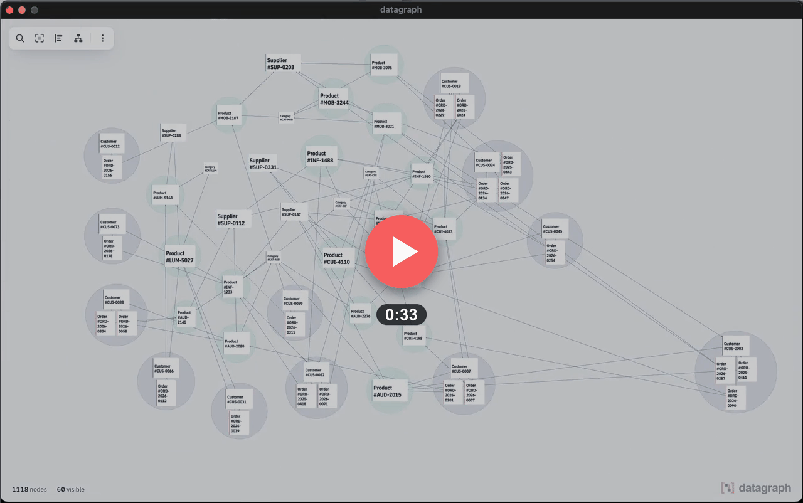

<h1>
  
</h1>

**Interactive visualization for complex JSON documents: keyed records and real reference edges.**

Most JSON visualizers draw a literal tree. Every object becomes a box, every
key an edge. That works on small documents, and falls apart on real domain
data: records with hundreds of nested fields, foreign keys pointing across the
document, collections with thousands of rows.

`datagraph` renders the same interactive box-and-line canvas, but on top of a
domain model instead of the raw JSON structure. You declare which paths hold
keyed records (`ids`, e.g. `Customer`, `Order`) and which fields join them
(`refs`, e.g. `Order.customerId → Customer`). The graph then carries two edge
kinds: containment (parent/child structure) and reference (real foreign keys).
Only what is expanded gets rendered, so a 10,000-node dataset stays smooth.
You can pan, zoom, expand and collapse, drag a card out of the way, click a
reference to jump to its target, and search across every field.

Two views are built in. The default structure view lays out the containment
tree (ELK layered). The optional graph view switches to records-as-vertices
and joins-as-edges, grouped into DDD aggregates drawn as circular envelopes;
see [`config.groups`](#config-ids-refs-groups) and
[`docs/graph-view.md`](./docs/graph-view.md).

<!-- A still that links out, not an inline player. GitHub strips every <video>
     tag from Markdown, and injects a player only for URLs on its own attachment
     hosts, so neither a repository path nor a third-party URL can play in
     place here. The clip itself is website/static/video/trailer.mp4, served by
     the documentation site; the thumbnail is a still cut from it by hand. -->

[](https://datagraph.defsquare.com/)

*Thirty seconds, from `datagraph demo.json -c demo.config.json` to the graph
view: the structure view expands records and follows a foreign key to its
target, then the same sixty records are redrawn as vertices and joins, clustered
into aggregates. The clip plays on
[datagraph.defsquare.com](https://datagraph.defsquare.com/).*

You use it as a **standalone desktop app**: the `datagraph` binary opens a
JSON file straight from the shell, no code to write; see
[The `datagraph` CLI](#the-datagraph-cli). An embeddable JS package,
`@defsquare/datagraph`, lives in [`packages/renderer`](./packages/renderer)
but is not published to npm yet.

## Packages

| Package | Description |
| --- | --- |
| [`@defsquare/datagraph-tokens`](./packages/tokens) | Design tokens: the single source of truth behind both the renderer themes and the shell CSS variables. |
| [`@defsquare/datagraph-chrome`](./packages/chrome) | Chrome primitives: CSS, icons and markup factories shared by the demo and the playground. Never published. |
| [`@defsquare/datagraph-core`](./packages/core) | Headless: `buildGraph`, `CollapseState`, `buildSearchIndex`, `createStructureLayoutEngine`. No rendering, no DOM. |
| [`@defsquare/datagraph`](./packages/renderer) | Pixi.js renderer on top of core: `createDataGraph`, themes. |
| [`apps/demo`](./apps/demo) | Vite demo, Playwright e2e, and the Tauri desktop shell that doubles as the `datagraph` CLI. |
| [`apps/design`](./apps/design) | Design system playground: tokens, graph and UI components, and a live sandbox. Never published. |

## The `datagraph` CLI

The demo app packaged as a Tauri v2 desktop binary. Point it at a JSON
document and it opens the canvas described above, with no project to set up
and no code to write.

### Install on macOS (Apple silicon)

Each release uploads the prebuilt binary to defsquare's download host and
pushes the matching formula to the defsquare tap, so the shortest route is
Homebrew:

```bash
brew install defsquare/tap/datagraph
```

Later versions arrive with `brew upgrade datagraph`. Without Homebrew, take
the tarball directly; that URL always serves the most recent release:

```bash
curl -fsSL https://dl.datagraph.defsquare.com/datagraph/datagraph-darwin-arm64.tar.gz | tar -xz
sudo mv datagraph /usr/local/bin/
```

The binary is not signed by an Apple Developer identity. In practice that
changes nothing here: `curl` sets no `com.apple.quarantine` attribute on what
it writes (Homebrew downloads with `curl` too), so Gatekeeper never assesses
the file and either install runs without a prompt. A *browser* download does
set the attribute, and macOS then refuses to open the binary. Clear it once:

```bash
xattr -d com.apple.quarantine ./datagraph
```

There is no `.app` or `.dmg` bundle on any platform. `tauri build` produces a
raw executable meant to be launched from a shell, which is what makes the CLI
arguments useful in the first place.

### Build from source

The fallback on any platform, and the only route on Intel Macs, Linux and
Windows. You need pnpm and a Rust toolchain (Tauri v2).

```bash
# from a clone of this repository
pnpm install
pnpm --filter demo tauri build   # → apps/demo/src-tauri/target/release/datagraph
```

The built binary is not on your `PATH`; symlink it somewhere that is:

```bash
ln -s "$PWD/apps/demo/src-tauri/target/release/datagraph" /usr/local/bin/datagraph
```

### Usage

```bash
datagraph data.json -c config.json  # a JSON document with its ids/refs/groups config
datagraph data.json                 # no config: structure view only
datagraph                           # no argument: the built-in demo dataset
datagraph --help

datagraph --check data.json -c config.json          # validate the config, print a report, exit
datagraph --check data.json -c config.json --json   # same report, as JSON
```

The `-c` file is the `ids` / `refs` / `groups` object documented in
[Config: ids, refs, groups](#config-ids-refs-groups), as plain JSON. Without
it, nothing is declared as an entity or a join, so you get the containment
structure view only. Sample files ship with the repo:

```bash
datagraph apps/demo/fixtures/shop.json -c apps/demo/fixtures/shop.config.json
```

A large file opens on a preview, not in full. The initial expansion stops at
~300 cards, and each further expansion reveals 100 children at a time, a
clickable `+ n` token standing in for each run still hidden. Search reveals
just the page holding its target. The toolbar's Ranger button (`tidy()` in the
API) re-lays out everything visible in one pass, which is how you straighten
the columns after a long exploration. Nothing changes for a document that fits
under the budget; the rules, and why they are these ones, are in
[Structure view](./packages/renderer/README.md#structure-view).

Argument and file errors are reported on stderr, with a non-zero exit code,
before any window opens. Exit codes, the CSP and the vendored fonts are
covered in [`apps/demo/README.md`](./apps/demo/README.md).

### Checking a config without opening it

`--check` builds the graph, prints a report on stdout and exits. No window.
It reports, per selector, how many instances matched and whether the path
resolves at all, and per reference, how many joins resolved or dangled.

<!-- Copy this block from the binary's own output rather than typing it by
     hand: the columns are computed, and a hand-typed example drifts. -->

```
✓ config valid — 4 entities, 2 references resolved

  ids
    Customer  $.customers[*].id  2 instances
    Order     $.orders[*].id     2 instances
  refs
    $.orders[*].customerId → $.customers[*].id    2/2 resolved

  No diagnostics.
```

The exit code answers one question: *can I fix this by editing the config?*
`0` means valid (the report may still carry data diagnostics), `3` invalid
config, `4` internal error. The existing `1` (unreadable file) and `2` (bad
argument) are unchanged. A dangling foreign key, a duplicate id or a
missing id is a hole in the *data*, so it stays at `0`. An unresolved selector
prefix, or a reference declaration nothing satisfied, is a *config* bug, so it
exits `3`.

`--json` prints the same report as JSON, with a `"report": 1` version field.
Its `totals.logicalNodes` count (the graph nodes plus the scalar rows) is the
one `maxNodes` bounds, so it is the one to compare against the number a
`GraphTooLargeError` quotes. One Windows caveat: a release build launched from
a console has no stdout handle, so redirect or pipe the output to capture the
report, which is how an agent invoking it captures it anyway.

## The Claude Code plugin

`datagraph` has one non-human user worth first-class support: an agent asked
to show somebody a JSON document. The repo ships a Claude Code skill,
[`skills/datagraph/`](./skills/datagraph/), that teaches the agent the whole
protocol. Shape the data so the cards read well, write an `ids` / `refs` /
`groups` config against the document's real paths, validate it with
[`--check`](#the-datagraph-cli) before opening anything, launch the window
detached. Install it from defsquare's org marketplace,
[`defsquare/claude-marketplace`](https://github.com/defsquare/claude-marketplace):

```
/plugin marketplace add defsquare/claude-marketplace
/plugin install datagraph@defsquare
```

The plugin installs the *skill* only; the binary itself still arrives through
[Homebrew or the tarball](#the-datagraph-cli). The skill is versioned with the
binary whose behaviour it documents, so a CLI change and its skill update
travel in the same commit (ADR-0035, ADR-0038).

## Config: ids, refs, groups

`config.ids` maps a name to a JSONPath-like selector (`$`, `.key`, `[index]`,
and `*` wildcards for either) that ends in the field holding the id, e.g.
`"$.customers[*].id"`. Any object matched by a selector (dropping the trailing
id-field segment) becomes an *entity* node instead of a plain object node.
Entities are the only nodes that start collapsed, and the only sources and
targets of reference edges.

`config.refs` is an array of joins, `{ from, to }`. `from` selects a field
whose value is meant to be read as a foreign key; `to` is one of the paths
declared in `ids`. `datagraph` resolves each `from` value against the target's
index at build time and draws a reference edge, highlighted differently when
the target id doesn't exist.

```json
{
  "ids": {
    "Customer": "$.customers[*].id",
    "Order": "$.orders[*].id"
  },
  "refs": [
    { "from": "$.orders[*].customerId", "to": "$.customers[*].id" }
  ],
  "groups": ["Customer"],
  "maxNodes": 1000000,
  "rootLabel": "$"
}
```

- `ids.<Name>`: selector for where instances of `<Name>` live in the document,
  ending in the id field.
- `refs[].from`: selector for a field whose value is a foreign key.
- `refs[].to`: the `ids` path it must resolve against.
- `groups`: names from `ids` that are DDD aggregate roots, in declaration
  order. That order is load-bearing: it decides which root claims a record
  that reaches two of them at the same distance. See
  [the core package README](./packages/core/README.md#aggregates) for the
  membership rule and the [graph view](./packages/renderer/README.md#graph-view)
  it powers.
- `maxNodes`: optional safety cap (default `1000000`). Past it, `buildGraph`
  throws `GraphTooLargeError`, and the message names the way out (raise
  `maxNodes` in the `-c` config). It guards the *memory* of the built graph
  and its search index, not layout cost: the views bound what they lay out
  themselves. The default is where
  [the core package's benchmark](./packages/core/README.md#benchmark) put it,
  about 3× under the memory budget.
- `rootLabel`: label shown on the root node (default `"$"`, the root symbol of
  the same selector syntax `ids` uses). Set it to something your users
  recognise (`"Shop"`, `"Invoice"`) when the graph is customer-facing. An
  empty string is honoured rather than falling back to the default.

**Limitation:** field keys that don't match the selector token grammar (e.g.
`@odata:id`) cannot be declared as reference fields.

## Monorepo layout

```
datagraph/
├── packages/
│   ├── tokens/    @defsquare/datagraph-tokens — design tokens, CSS generator
│   ├── chrome/    @defsquare/datagraph-chrome — chrome primitives, never published
│   ├── core/      @defsquare/datagraph-core — graph model, layout, search
│   └── renderer/  @defsquare/datagraph — Pixi.js renderer, themes
├── apps/
│   ├── demo/      Vite app demonstrating the renderer + Playwright e2e
│   │   └── src-tauri/  Tauri v2 desktop shell + `datagraph` CLI (Rust)
│   └── design/    design system playground (port 5174), never published
├── bin/           release.sh — builds, publishes and taps a version
├── Formula/       datagraph.rb.tmpl — the Homebrew formula release.sh renders
├── skills/        the Claude Code skill the plugin installs (.claude-plugin/ manifests)
├── docs/
│   ├── graph-view.md        graph-view layout, guarantees and measurements
│   └── trailer-poster.png   the README thumbnail, a still of the landing page's clip
├── website/       the Hugo site behind datagraph.defsquare.com — static/video/ holds the clip
├── LICENSE
└── README.md
```

## Development

```bash
pnpm install

pnpm typecheck      # tsc --noEmit across every package
pnpm build          # tsup build across every package
pnpm test           # vitest across every package, plus `cargo test` — run `pnpm build` FIRST
pnpm bench          # non-blocking perf bench (packages/core/bench/bench.ts)

pnpm --filter demo dev   # run the demo app locally
pnpm --filter demo e2e   # Playwright e2e (starts `pnpm dev` itself)
pnpm --filter design dev # design system playground on port 5174 (runs alongside the demo)

pnpm --filter demo tauri dev    # demo as a desktop app (Tauri v2) — needs a Rust toolchain
pnpm --filter demo tauri build  # standalone binary: apps/demo/src-tauri/target/release/datagraph
```

**Build before testing.** `packages/core/test/bundle-purity.test.ts` walks
`packages/core/dist/index.js` to prove the graph-view chunk stays out of the
main entry point, and `dist/` is gitignored. On a fresh clone the test fails,
with a message pointing at `pnpm build`, until something has been built. It
fails rather than skips, because a silent skip would give false assurance on a
bundle budget.

**The e2e need no build.** Playwright starts the app with `pnpm dev`, and Vite
aliases the workspace packages to `packages/*/src` in `serve` mode. The suite
always exercises the *sources* through Vite's dev pipeline, never the
published bundle, so any timing it reports is a dev-mode, unminified figure
(see [`docs/graph-view.md`](./docs/graph-view.md#what-the-tests-actually-hold)).

**Rust is part of `pnpm test`.** The CLI parser in
`apps/demo/src-tauri/src/cli.rs` has its own unit tests, run through
`cargo test` by `apps/demo`'s `test` script. A Rust toolchain is therefore
required for a full `pnpm test`; run `pnpm --filter '!demo' -r test` to skip
it.

### Release

`bin/release.sh <version>` does the whole publication from a maintainer's Mac.
It builds the arm64 binary, uploads the tarball to the Cloudflare R2 bucket
behind the download host (under a versioned key and the stable
`datagraph-darwin-arm64.tar.gz` one), tags the version, then renders
`Formula/datagraph.rb.tmpl` and pushes it to the Homebrew tap. The artifact
goes up before the formula, so a formula never points at a tarball that does
not exist yet. Uploads authenticate through Cloudflare's own OAuth: run
`wrangler login` once, and no token lives in the environment or the repo. The
bucket, the download base URL and the local tap checkout come from the
git-ignored `bin/release.env`; copy
[`bin/release.env.example`](./bin/release.env.example) and fill it in. Add
`--dry-run` to see the plan and the rendered formula without touching the
network.

## License

[MIT](./LICENSE) © 2026 Defsquare
