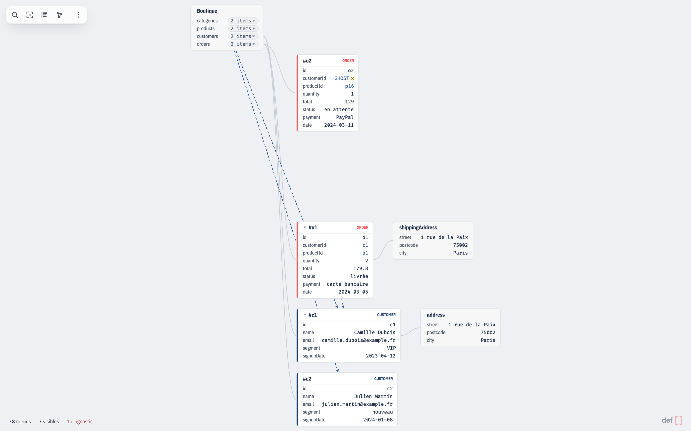
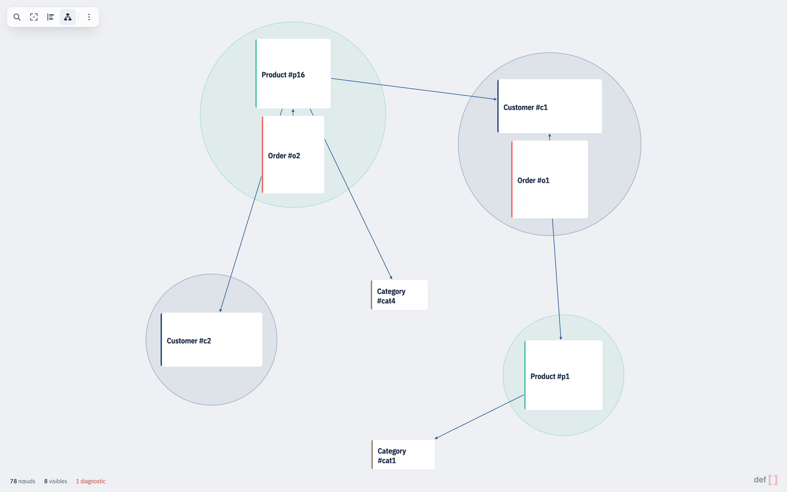

<h1>
  
</h1>

**Interactive visualization for complex JSON documents — keyed records and real reference edges.**

Most JSON visualizers draw a literal tree: every object and array becomes a
box, every key becomes an edge. That's fine for small documents, but it falls
apart on real domain data — records with hundreds of nested fields, foreign
keys that point across the document, collections with thousands of rows.

`datagraph` renders that same interactive box-and-line canvas, but on top of a
**domain model** instead of raw JSON structure: you declare, in `ids`, which
paths in your data are *keyed records* (e.g. `Customer`, `Order`), and, in
`refs`, which fields *join* them (e.g.
`Order.customerId → Customer`). It then builds a graph with two edge kinds —
containment (parent/child structure) and reference (real foreign keys) — and
renders only what's expanded, so a 10,000-node dataset stays smooth: pan,
zoom, expand/collapse, drag a card (or a whole aggregate, in the graph view)
out of the way, click a reference to jump to its target, and search across
every field.

Two views are built in. The default **structure view** lays out the
containment tree (parent/child, ELK layered). An optional **graph view**
switches the canvas to records-as-vertices, joins-as-edges, grouped
into DDD aggregates drawn as circular envelopes — see [`config.groups`](#config-ids-refs-groups),
[the renderer's graph view docs](./packages/renderer/README.md#graph-view)
and [`docs/graph-view.md`](./docs/graph-view.md).



*Structure view: the containment tree, with foreign keys drawn as reference edges.*



*Graph view: the same document as records and joins, grouped into aggregates.*

There are two ways to use it. As a **standalone desktop app**, the `datagraph`
binary opens a JSON file straight from the shell, no code to write — see
[The `datagraph` CLI](#the-datagraph-cli). As a **JS package**,
`@defsquare/datagraph` mounts the same canvas into a container in your own
app — see [The `@defsquare/datagraph` package](#the-defsquaredatagraph-package).

## Packages

| Package | Description |
| --- | --- |
| [`@defsquare/datagraph-tokens`](./packages/tokens) | Design tokens — the single source of truth behind both the renderer themes and the shell CSS variables. |
| [`@defsquare/datagraph-chrome`](./packages/chrome) | Chrome primitives — CSS, icons and markup factories shared by the demo and the playground. Never published. |
| [`@defsquare/datagraph-core`](./packages/core) | Headless: `buildGraph`, `CollapseState`, `buildSearchIndex`, `createStructureLayoutEngine`. No rendering, no DOM. |
| [`@defsquare/datagraph`](./packages/renderer) | Pixi.js renderer on top of core: `createDataGraph`, themes. |
| [`apps/demo`](./apps/demo) | Vite demo, Playwright e2e, and the Tauri desktop shell that doubles as the `datagraph` CLI. |
| [`apps/design`](./apps/design) | Design system playground: tokens, graph and UI components, and a live sandbox. Never published. |

## The `datagraph` CLI

`datagraph` is the demo app packaged as a **Tauri v2 desktop app**, and that
binary is the end-user tool: point it at a JSON document and it opens the
canvas described above, with no project to set up and no code to write.

**Install on macOS.** Each release uploads the prebuilt binary to defsquare's
download host and pushes the matching formula to the defsquare tap, so the
shortest route is Homebrew:

```bash
brew install defsquare/tap/datagraph
```

Later versions arrive with `brew upgrade datagraph`.

**Without Homebrew**, take the tarball directly; that URL always serves the most
recent release.

```bash
curl -fsSL https://dl.datagraph.defsquare.com/datagraph/datagraph-darwin-arm64.tar.gz | tar -xz
sudo mv datagraph /usr/local/bin/
```

The prebuilt binary is **Apple silicon (arm64) only** — on an Intel Mac, build
from source (the fallback below) — and it is **not signed by an Apple Developer
identity**. That matters
less than it sounds: `curl` sets no `com.apple.quarantine` attribute on what it
writes — and Homebrew downloads with `curl` too — so Gatekeeper never assesses
the file and either install runs without a prompt. Downloading the tarball with
a **browser** does set the attribute, and then macOS refuses to open the
binary; clear it once and the binary behaves like any other:

```bash
xattr -d com.apple.quarantine ./datagraph
```

There is no `.app` / `.dmg` bundle on any platform — `bundle.active` is
`false`, so `tauri build` produces a raw executable meant to be launched from a
shell, which is what makes the CLI arguments useful in the first place.

**Fallback: build from source** (any platform, and the only route on Linux and
Windows). You need **pnpm** and a **Rust toolchain** (Tauri v2).

```bash
# from a clone of this repository
pnpm install
pnpm --filter demo tauri build   # → apps/demo/src-tauri/target/release/datagraph
```

The built binary is not on your `PATH`: copy it, or symlink it, somewhere that is.

```bash
ln -s "$PWD/apps/demo/src-tauri/target/release/datagraph" /usr/local/bin/datagraph
```

**Usage.**

```bash
datagraph data.json -c config.json  # a JSON document with its ids/refs/groups config
datagraph data.json                 # no config: structure view only
datagraph                           # no argument: the built-in demo dataset
datagraph --help

datagraph --check data.json -c config.json          # validate the config, print a report, exit
datagraph --check data.json -c config.json --json   # same report, as JSON
```

The `-c` file is the `ids` / `refs` / `groups` object documented in
[Config: ids, refs, groups](#config-ids-refs-groups), as plain JSON. Without
it, nothing is declared as an entity or a join, so you get the containment
structure view only.

Sample files ship with the repo, so a fresh build has something to open:

```bash
datagraph apps/demo/fixtures/shop.json -c apps/demo/fixtures/shop.config.json
```

**A large file opens on a preview, not in full.** The initial expansion stops
at ~300 cards, so what gets laid out on opening no longer grows with the file;
a single expansion then reveals 100 children at a time, a clickable
`+ n` token standing in for each run still hidden (search reveals just the page
holding its target, tokens on either side); and the toolbar's **Ranger** button
— `tidy()` in the API — re-lays out everything visible in one pass, which is
how you straighten the columns after a long exploration. Nothing changes for a
document that fits under the budget. The rules, and why they are these ones,
are in [Structure view](./packages/renderer/README.md#structure-view).

Argument and file errors are reported on stderr with a non-zero exit code
before any window opens. See [`apps/demo/README.md`](./apps/demo/README.md) for
the details — exit codes, the CSP, the vendored fonts.

**Checking a config without opening it.** `--check` builds the graph, prints a
report on stdout and exits — no window. It reports, per selector, how many
instances it matched and whether its path resolves at all, and per reference how
many joins resolved or dangled. On a Windows release build launched from a
console, the report never reaches the screen — stdout has no handle there —
but it works when the output is redirected or piped, which is how an agent
invoking it captures it.

```
✓ config valid — 4 entities, 2 references resolved

  ids
    Customer  $.customers[*].id  2 instances
    Order     $.orders[*].id     2 instances
  refs
    $.orders[*].customerId → $.customers[*].id    2/2 resolved

  No diagnostics.
```

(Copy this block from the binary's own output rather than from here — the columns
are computed, and a hand-typed example drifts.)

The exit code answers one question — *can I fix this by editing the config?*
`0` valid (the report may still carry data diagnostics), `3` invalid config,
`4` internal error, on top of the existing `1` for an unreadable file and `2`
for a bad argument. A dangling foreign key, a duplicate id or a missing id is a
hole in the **data**, so it stays at `0`; an unresolved selector prefix or a
reference declaration nothing satisfied is a **config** bug, so it exits `3`.
`--json` prints the same report as JSON, carrying a `"report": 1` version field.
Its `totals` hold two node counts: `nodes`, the size of the graph, and
`logicalNodes`, the same nodes plus the scalar rows — the second is the one
`maxNodes` bounds, so it is the one to compare against the number a
`GraphTooLargeError` quotes.

## The Claude Code plugin

`datagraph` has one non-human user worth first-class support: an agent asked to
show somebody a JSON document. The repo ships a Claude Code skill —
[`skills/datagraph/`](./skills/datagraph/) — that teaches the agent the whole
protocol: shape the data so the cards read well, write an `ids` / `refs` /
`groups` config against the document's real paths, validate it with
[`--check`](#the-datagraph-cli) before opening anything, and launch the window
detached. The repo doubles as a plugin marketplace, so installing it is:

```
/plugin marketplace add https://gitlab.com/defsquare/datagraph.git
/plugin install datagraph@defsquare
```

The plugin installs the *skill* only; the binary itself still arrives through
[Homebrew or the tarball](#the-datagraph-cli). The skill is versioned with the
binary whose behaviour it documents, so a CLI change and its skill update
travel in the same commit (ADR-0035).

## The `@defsquare/datagraph` package

The other way in: embedding the renderer in your own app, rather than opening a
file with [the CLI](#the-datagraph-cli) above.

```bash
pnpm add @defsquare/datagraph
```

Not yet, though: the packages are not published to npm at the time of writing,
so until they are, the only way to consume them is from a clone of this
repository, as workspace dependencies.

`@defsquare/datagraph` depends on `@defsquare/datagraph-core` and `pixi.js`
directly (they're installed automatically), and on `elkjs` for layout.

This is the exact bootstrap used by [`apps/demo`](./apps/demo/src/main.ts),
whose small fixture is a four-entity-type e-commerce shop:

```ts
import { createDataGraph } from "@defsquare/datagraph";

const shopData = {
  categories: [
    { id: "cat1", name: "Informatique" },
    { id: "cat4", name: "Audio" },
  ],
  products: [
    { id: "p1", name: "Clavier mécanique", reference: "INF-1000",
      price: 89.9, stock: 42, categoryId: "cat1" },
    { id: "p16", name: "Casque bluetooth", reference: "AUD-1555",
      price: 129, stock: 17, categoryId: "cat4" },
  ],
  customers: [
    { id: "c1", name: "Camille Dubois", email: "camille.dubois@example.fr",
      address: { street: "1 rue de la Paix", postcode: "75002", city: "Paris" },
      segment: "VIP", signupDate: "2023-04-12" },
    { id: "c2", name: "Julien Martin", email: "julien.martin@example.fr",
      segment: "nouveau", signupDate: "2024-01-08" },
  ],
  orders: [
    { id: "o1", customerId: "c1", productId: "p1", quantity: 2, total: 179.8,
      status: "livrée", payment: "carte bancaire", date: "2024-03-05",
      shippingAddress: { street: "1 rue de la Paix", postcode: "75002", city: "Paris" } },
    // `GHOST` doesn't exist: a deliberate dangling reference.
    { id: "o2", customerId: "GHOST", productId: "p16", quantity: 1, total: 129,
      status: "en attente", payment: "PayPal", date: "2024-03-11" },
  ],
};

const shopConfig = {
  ids: {
    Customer: "$.customers[*].id",
    Order: "$.orders[*].id",
    Product: "$.products[*].id",
    Category: "$.categories[*].id",
  },
  refs: [
    { from: "$.orders[*].customerId", to: "$.customers[*].id" },
    { from: "$.orders[*].productId", to: "$.products[*].id" },
    { from: "$.products[*].categoryId", to: "$.categories[*].id" },
  ],
  rootLabel: "Boutique",
  groups: ["Customer", "Product"],
};

const container = document.getElementById("app")!;

const graph = createDataGraph(container, {
  data: shopData,
  config: shopConfig,
  // Best-effort Web Worker offload for the ELK layout pass; falls back
  // in-process automatically if the worker can't be spun up.
  elkWorkerUrl: new URL("elkjs/lib/elk-worker.min.js", import.meta.url),
  // Same deal for the graph view's own layout, which is where the seconds are
  // on large datasets. Same permanent in-process fallback on first failure.
  graphLayoutWorkerUrl: new URL("@defsquare/datagraph/graph-layout-worker", import.meta.url),
});

await graph.ready;
graph.fit();

graph.on("select", (node) => console.log("selected:", node.label));
graph.on("followRef", (edge) => console.log("followed ref:", edge.field));
```

## Config: ids, refs, groups

`config.ids` maps a name to a JSONPath-like selector (`$`, `.key`, `[index]`,
and `*` wildcards for either) that ends in the field holding its id — e.g.
`"$.customers[*].id"`. Any object matched by a selector (dropping the
trailing id-field segment) becomes an *entity* node instead of a plain object
node — entities are the only nodes that start collapsed, and the only
source/target of reference edges.

`config.refs` is an array of joins, `{ from, to }`: `from` is a selector for
a field whose value is meant to be read as a foreign key, and `to` is one of
the paths declared in `ids`. `datagraph` resolves `from`'s value against the
target's index at build time and draws a reference edge (dangling and
highlighted differently if the target id doesn't exist).

```json
{
  "ids": {
    "Customer": "$.customers[*].id",
    "Order": "$.orders[*].id"
  },
  "refs": [
    { "from": "$.orders[*].customerId", "to": "$.customers[*].id" }
  ],
  "groups": ["Customer"],
  "maxNodes": 1000000,
  "rootLabel": "$"
}
```

- `ids.<Name>` — selector for where instances of `<Name>` live in the document, ending in the id field.
- `refs[].from` — selector for a field whose value is a foreign key.
- `refs[].to` — the `ids` path it must resolve against.
- `groups` — names from `ids` that are DDD aggregate roots, in declaration order. That order
  is load-bearing: it decides which root claims a record that reaches two of them at the same
  distance. See [the core package README](./packages/core/README.md#aggregates) for the membership
  rule and the [graph view](./packages/renderer/README.md#graph-view) it powers.
- `maxNodes` — optional safety cap (default `1000000`); `buildGraph` throws `GraphTooLargeError`
  past it, and the message names the way out (raise `maxNodes` in the `-c` config). It guards the
  *memory* of the built graph and its search index, not layout cost — the views bound what they
  lay out themselves (see [Structure view](./packages/renderer/README.md#structure-view)), which
  is why the cap could be raised twentyfold. The default is where the
  benchmark put it: 1M logical nodes measured at ~479 MB of heap and ~814 ms to build and index,
  about 3× under the budget — see
  [the core package's benchmark](./packages/core/README.md#benchmark).
- `rootLabel` — label shown on the root node (default `"$"`, the root symbol of
  the same selector syntax `ids` uses). Set it to something your users
  recognise — `"Shop"`, `"Invoice"` — when the graph is customer-facing. An
  empty string is honoured rather than falling back to the default.

**Limitation:** field keys that don't match the selector token grammar (e.g.
`@odata:id`) can no longer be declared as reference fields.

## API

`createDataGraph(container, options)` returns a `DataGraph` handle:

- **Camera and navigation** — `ready`, `fit()`, `focus(id)`, `destroy()`.
- **Structure view only** — `expand(id)`, `collapse(id)`, `tidy()`.
- **Selection and events** — `select(id)`, `on("select" | "followRef", cb)`, `refEdges(from)`.
- **Search** — `search(query)`, `nextMatch()`, `prevMatch()`.
- **Data, views, theme** — `setData(data, config?)`, `setView("structure" | "graph")`,
  `currentView()`, `setTheme(theme)`.
- **Introspection** — `diagnostics()`, `stats()`.

The full reference table — every member, its exact semantics, and its
view-specific caveats — lives in the published package's README:
[**Public API — `DataGraph`**](./packages/renderer/README.md#public-api--datagraph).
Gestures, dimming rules and the graph view are documented there too.

## Themes

`@defsquare/datagraph` ships four built-in themes — `defsquareLight` (the
default), `defsquareDark`, `neutralLight`, `neutralDark` — and lets you
override any subset of theme tokens per instance:

```ts
import { createDataGraph, defsquareDark } from "@defsquare/datagraph";

const graph = createDataGraph(container, {
  data,
  config,
  theme: {
    accent: { selection: "#0ea5e9" },
    byEntityType: { Order: { accent: "#f59e0b" } },
  },
});

// Swap to the dark theme at runtime, in place — no relayout, no re-measuring
// fonts, so this is safe for a light/dark toggle.
graph.setTheme(defsquareDark);
```

A `Theme` is grouped by role rather than a flat color bag: `surface`, `ink`,
`accent`, `edge`, `typography`, `radii`, `strokes`, `entityPalette`, an
optional `byEntityType`, and `fonts`. `theme` in `createDataGraph`'s options is
a `ThemeOverride` — any subset of that shape, deep-merged one level per group
via the exported `resolveTheme(partial?, base?)`. See the
[renderer package README](./packages/renderer/README.md#themes) for the full
token list and more examples, and
[`packages/renderer/src/theme.ts`](./packages/renderer/src/theme.ts) for the
exact shape.

## Monorepo layout

```
datagraph/
├── packages/
│   ├── tokens/    @defsquare/datagraph-tokens — design tokens, CSS generator
│   ├── chrome/    @defsquare/datagraph-chrome — chrome primitives, never published
│   ├── core/      @defsquare/datagraph-core — graph model, layout, search
│   └── renderer/  @defsquare/datagraph — Pixi.js renderer, themes
├── apps/
│   ├── demo/      Vite app demonstrating the renderer + Playwright e2e
│   │   └── src-tauri/  Tauri v2 desktop shell + `datagraph` CLI (Rust)
│   └── design/    design system playground (port 5174), never published
├── bin/           release.sh — builds, publishes and taps a version
├── Formula/       datagraph.rb.tmpl — the Homebrew formula release.sh renders
├── skills/        the Claude Code skill the plugin installs (.claude-plugin/ manifests)
├── docs/
│   ├── graph-view.md   graph-view layout, guarantees and measurements
│   └── superpowers/    historical journal of spikes, specs and plans
├── LICENSE
└── README.md
```

## Development

```bash
pnpm install

pnpm typecheck      # tsc --noEmit across every package
pnpm build          # tsup build across every package
pnpm test           # vitest across every package, plus `cargo test` — run `pnpm build` FIRST
pnpm bench          # non-blocking perf bench (packages/core/bench/bench.ts)

pnpm --filter demo dev   # run the demo app locally
pnpm --filter demo e2e   # Playwright e2e (starts `pnpm dev` itself)
pnpm --filter design dev # design system playground on port 5174 (runs alongside the demo)

pnpm --filter demo tauri dev    # demo as a desktop app (Tauri v2) — needs a Rust toolchain
pnpm --filter demo tauri build  # standalone binary: apps/demo/src-tauri/target/release/datagraph
```

**`pnpm build` must precede `pnpm test`.** `packages/core/test/bundle-purity.test.ts`
walks `packages/core/dist/index.js` to prove the graph-view chunk stays out of
the main entry point's transitive closure, and `dist/` is gitignored, so on a
fresh clone it fails until something has been built. It fails with an actionable
message rather than skipping: a silent skip would give false assurance on a
bundle budget.

**The e2e do not need a build.** `apps/demo/playwright.config.ts` starts the app
with `pnpm dev`, and `apps/demo/vite.config.ts` aliases the workspace packages
to `packages/*/src` in `serve` mode — so the Playwright suite always exercises
the *sources*, through Vite's dev pipeline, and never the published bundle. Any
timing it reports is a dev-mode, unminified figure (see
[`docs/graph-view.md`](./docs/graph-view.md#what-the-tests-actually-hold)).

**Rust tests are part of `pnpm test`.** The CLI parser in
`apps/demo/src-tauri/src/cli.rs` has its own unit tests; `apps/demo`'s `test`
script runs `cargo test --manifest-path src-tauri/Cargo.toml`, so `pnpm -r test`
at the root covers them alongside vitest. A Rust toolchain is therefore required
for a full `pnpm test` — run `pnpm --filter '!demo' -r test` to skip it.

**Desktop app and CLI.** Both `tauri` commands need a Rust toolchain. What the
resulting binary is, and how to install it, is in
[The `datagraph` CLI](#the-datagraph-cli).

**Release.** `bin/release.sh <version>` does the whole publication from a
maintainer's Mac: it builds the arm64 binary, uploads the tarball to the
Cloudflare R2 bucket behind the download host — under both a versioned key and
the stable `datagraph-darwin-arm64.tar.gz` one — tags the version, then renders
`Formula/datagraph.rb.tmpl` and pushes it to the Homebrew tap. The artifact goes
up before the formula, so a formula never points at a tarball that does not
exist yet. The upload authenticates through Cloudflare's own OAuth — run
`wrangler login` once; no token lives in the environment or the repository. The
bucket, the download base URL and the local tap checkout come from
`bin/release.env`, which is git-ignored — copy
[`bin/release.env.example`](./bin/release.env.example) and fill it in. Add
`--dry-run` to see the plan and the rendered formula without touching the
network.

## License

[MIT](./LICENSE) © 2026 Defsquare
