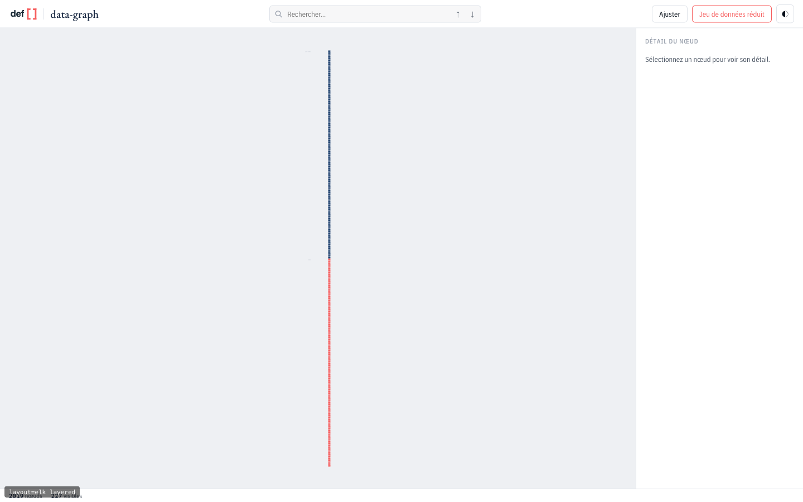
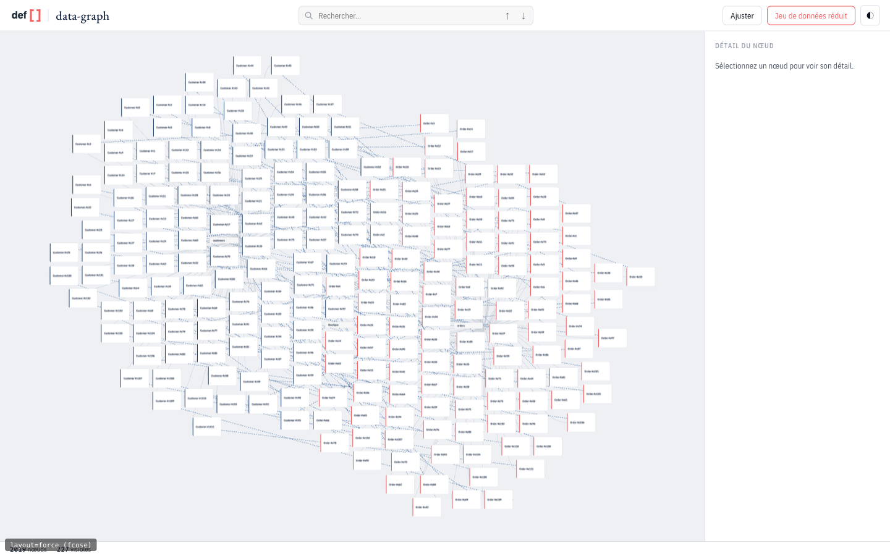

# Sonde — layout organique 2D (cytoscape/fcose)

**Branche** : `spike/organic-layout` · **Statut** : sonde terminée, code jetable
**Question** : avec beaucoup de nœuds, les nœuds d'un même niveau s'empilent en
une colonne infinie. Un layout organique type cytoscape est-il plus adapté ?

**Réponse courte** : oui, franchement. Le gain est spectaculaire et se voit à
l'œil nu. Mais il se paie sur trois axes — poids du bundle, déterminisme, et
surtout la continuité visuelle à l'expand — et le troisième est un vrai
problème produit, pas un détail de réglage.

---

## Le diagnostic

`elk.algorithm: layered` place tous les nœuds d'une même profondeur dans **une
seule colonne**. Nos données sont des étoiles : un tableau `customers` porte
*k* enfants, donc une colonne de *k* cartes. Le ratio de la bbox se dégrade
linéairement avec la largeur de l'arbre.

Sur le jeu de démo étendu (2019 nœuds logiques, 227 visibles au repos), après
`fit()` :

| | actuel (elk layered) | organique (fcose) |
|---|---|---|
|  | un trait vertical |  |

Ce n'est pas une caricature : c'est la capture réelle de la démo, aux mêmes
données et au même zoom. À 227 nœuds visibles, le layout actuel est déjà
illisible en vue d'ensemble.

## Les mesures

`pnpm --filter @defsquare/data-graph-core exec tsx bench/layout-compare.ts`, sur
un `wideShop(n)` (deux fratries de *n* entités — la forme qui empile) :

| nœuds visibles | moteur | bbox | ratio | remplissage | chevauchements | temps |
|---|---|---|---|---|---|---|
| 303 | elk layered | 1968×35376 | 1:18,0 | 5,7 % | 0 | 117 ms |
| 303 | fcose | 3122×2793 | 1,1:1 | 45,4 % | 0 | 547 ms |
| 803 | elk layered | 4468×94376 | 1:21,1 | 2,5 % | 0 | 309 ms |
| 803 | fcose | 3761×5915 | 1:1,6 | 47,4 % | 19 (0,1 % aire) | 2368 ms |

Le ratio passe de 1:21 à ~1:1,5 et la densité utile est multipliée par ~19.
C'est le cœur du gain.

## Deux pièges rencontrés (et ce qu'ils ont appris)

**1. fcose brut est inutilisable sur des cartes.** Ses valeurs par défaut sont
calibrées pour des nœuds ponctuels : à 800 nœuds, on mesure jusqu'à **94 % de
l'aire des cartes en recouvrement**. Les cartes se superposent en tas. Ce n'est
pas un défaut du modèle force-directed, c'est un défaut de calibrage.

**2. Ma première correction était fausse.** J'ai voulu dériver la longueur
d'arête idéale du fan-out : *k* enfants sur une couronne de circonférence 2πr
donnent r ≥ k·largeur/2π. Cette borne est **linéaire en k** et fait exploser la
mise en page — bbox de 45 000 px et **0,5 % de remplissage** à 800 nœuds, un
désert où les cartes sont des îlots invisibles. Les enfants n'ont aucune raison
de tenir sur un anneau : ils occupent un disque, donc la borne correcte est
celle de l'aire, πr² ≥ k·aire, soit r ≥ √(k·aire/π) — en **√k**.

Ce qui a réellement réglé le problème est ailleurs : une **passe de séparation**
en post-traitement (`separateOverlaps`), qui écarte par relaxation les
rectangles en collision le long de leur axe de moindre pénétration. Une force
converge vers un compromis attraction/répulsion, jamais vers une contrainte
dure de non-recouvrement ; il faut donc une passe qui, elle, l'impose.

Mesuré à 803 nœuds visibles :

| variante | ratio | remplissage | chevauchements |
|---|---|---|---|
| fcose brut | 1,7:1 | 137,9 % (⇒ tas) | 3129 (72,3 % aire) |
| + terme de fan-out (en aire) | 1:1,6 | 20,9 % | 0 |
| + passe de séparation seule | 1:1,7 | **46,1 %** | 0 |

La passe de séparation **subsume** le terme de fan-out : même zéro-chevauchement,
pour plus du double de densité. Le terme de fan-out reste dans le code en
option (`ignoreFanout: false`) parce qu'il converge en moins d'itérations, mais
il est désactivé par défaut.

## Les trois réserves

**1. L'incrémental — c'est le point bloquant.** `layoutAfterExpand` fait
aujourd'hui quelque chose de local et exact : layout du sous-arbre isolé, puis
un décalage vertical réversible. Une force-layout est globale.

| | dérive médiane | p95 | max |
|---|---|---|---|
| elk layered | 0 px | 0 px | 0 px |
| fcose (amorcé sur l'état précédent) | 1084 px | 2562 px | 3229 px |

Amorcer fcose sur les positions précédentes (`randomize: false`) aide, mais ne
suffit pas : **la carte que l'utilisateur regardait a déjà quitté l'écran** quand
le layout revient. La transition de 200 ms n'y change rien — elle animera un
remaniement complet. En l'état, développer un nœud est désorientant.

Et `layoutAfterCollapse` est synchrone par contrat : impossible d'y relancer une
force. J'y retire simplement les nœuds devenus invisibles, ce qui laisse un trou
qui ne se referme pas.

**2. Aucun déterminisme.** Deux `layout()` consécutifs sur les mêmes données
donnent un écart médian de **1589 px** (max 3014 px). Conséquences concrètes :
un rechargement de page ne redonne pas la même image, et les tests e2e ne
peuvent plus s'appuyer sur des positions.

**3. Le bundle.** Sur le build de production de la démo :

| | brut | gzip |
|---|---|---|
| `main` | 1785 ko | 548 ko |
| `spike/organic-layout` | 2372 ko | 731 ko |
| **delta** | **+587 ko** | **+183 ko** |

+33 % de bundle gzippé, pour un package qui embarque déjà elkjs et pixi. Si le
moteur organique est retenu, il doit être en import dynamique, pas dans le
chemin par défaut.

## Recommandation

Le gain de lisibilité est trop important pour être ignoré : **le layout actuel
ne tient tout simplement pas au-delà de ~100 nœuds visibles**, ce qui est peu.
Mais je ne recommande pas de remplacer ELK par fcose en l'état — la dérive à
l'expand échange un problème de lisibilité contre un problème d'orientation.

Trois suites possibles, par coût croissant :

1. **Rester sur ELK, corriger l'empilement.** C'est l'option que tu n'as pas
   retenue au départ, mais les mesures la remettent sur la table : elle garde le
   déterminisme, l'incrémental exact et zéro octet de bundle. Concrètement,
   disposer une fratrie large en bloc plutôt qu'en colonne — `elk.mrtree`, ou un
   `rectpacking` par parent en layout hiérarchique. À vérifier par une seconde
   sonde, nettement moins chère que celle-ci.
2. **fcose en vue d'ensemble seulement.** Le moteur organique pour l'affichage
   initial et le `fit()`, l'ELK incrémental dès qu'on entre dans le détail. Ça
   contourne la dérive au lieu de la résoudre, au prix de deux moteurs à
   maintenir.
3. **fcose partout, avec ancrage.** fcose accepte des `fixedNodeConstraint` : on
   pourrait figer les nœuds visibles à l'écran pendant un expand et ne relaxer
   que le reste. C'est la vraie réponse au problème de dérive, mais elle n'est
   pas sondée ici et demande un vrai travail.

Mon avis : lancer la sonde (1) avant de décider. Elle est courte, et si elle
donne un ratio acceptable, elle est strictement supérieure sur tous les autres
axes.

## Ce que contient la branche

- `packages/core/src/layout-force.ts` — le moteur, derrière la `LayoutEngine`
  existante (aucune modification du renderer nécessaire au-delà de l'aiguillage).
- `packages/core/bench/layout-compare.ts` — comparaison ELK/fcose : ratio,
  remplissage, chevauchements, stabilité à l'expand, déterminisme.
- `packages/core/bench/layout-tune.ts` — balayage de réglages fcose.
- Aiguillage `layout: "elk" | "force"` dans `DataGraphOptions`, exposé dans la
  démo par `?layout=force`, `?refs=1` (faire participer les refEdges),
  `?big=1` (démarrer sur le gros jeu de données).

**Tout est jetable.** Si la suite retenue n'est pas (2) ou (3), la branche
s'abandonne : `createForceLayoutEngine` et son export, l'option `layout` de
`DataGraphOptions`, les deux dépendances `cytoscape`/`cytoscape-fcose` et le
shim de types partent avec elle.

## Note sur les refEdges

Faire participer les références au layout (`?refs=1`) fonctionne et rapproche
visiblement les entités liées, mais coûte cher (7,7 s à 803 nœuds contre 2,4 s)
et dégrade légèrement le ratio. Ça n'a pas été le facteur décisif de la sonde ;
à reconsidérer seulement si l'option (2) ou (3) est retenue.
