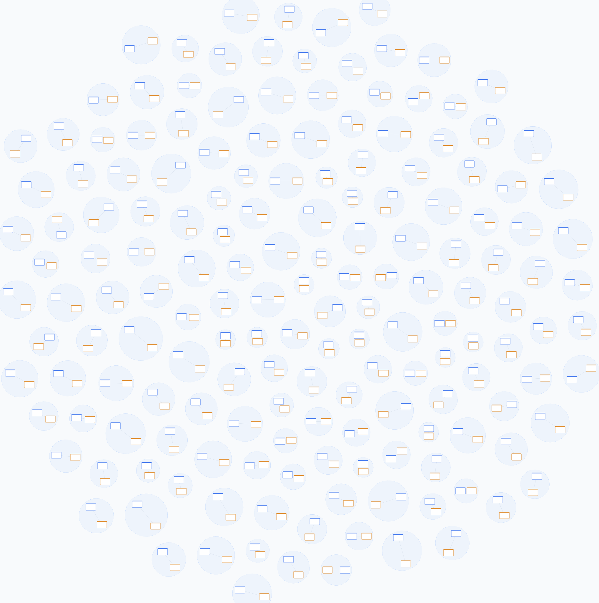
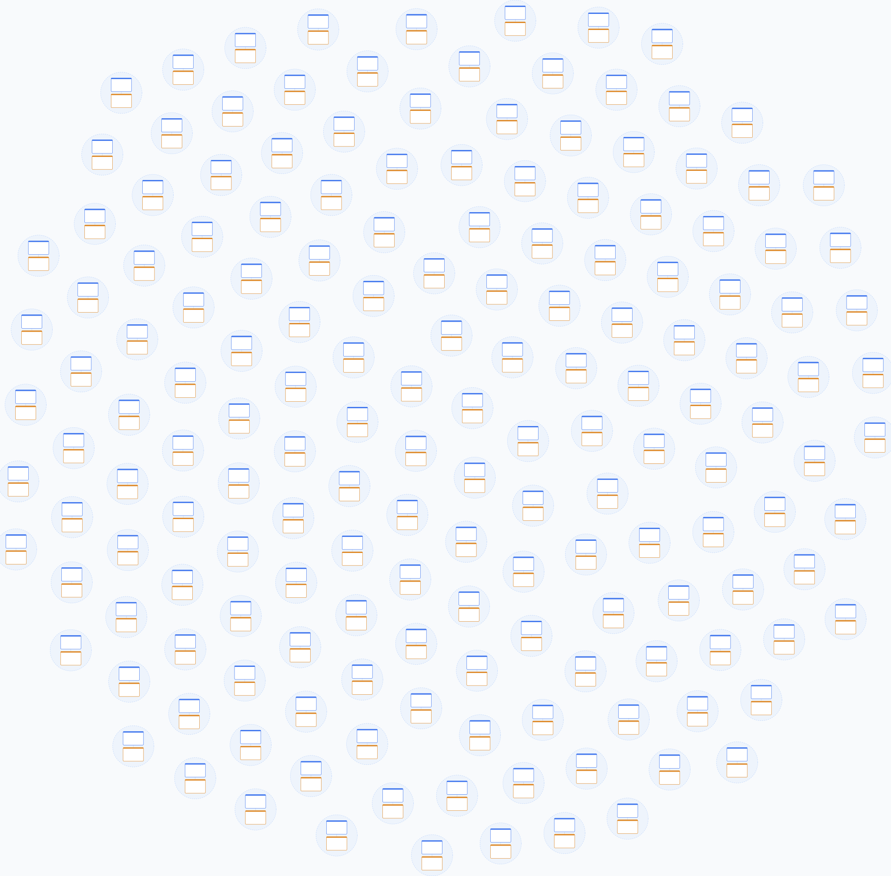
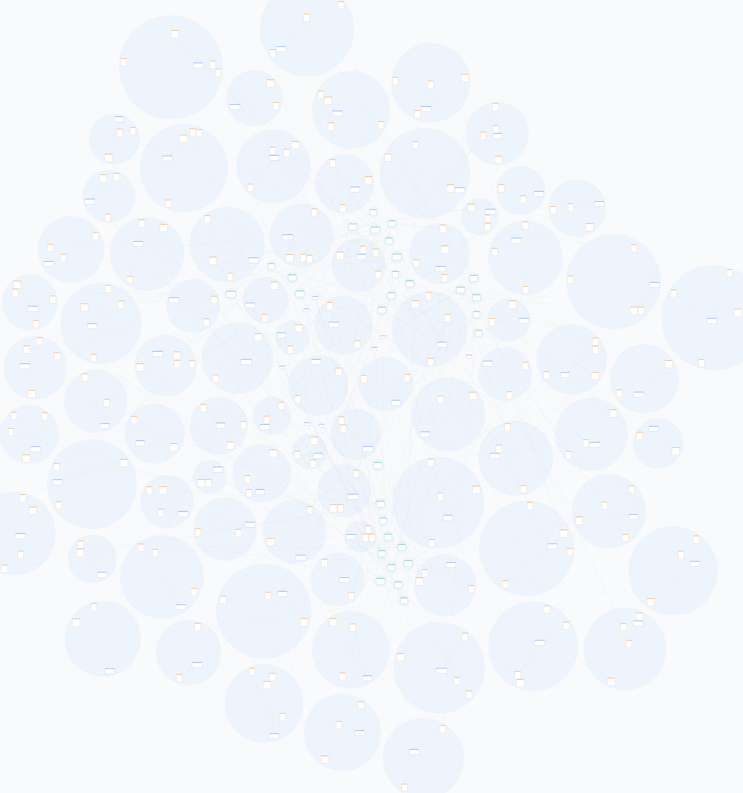
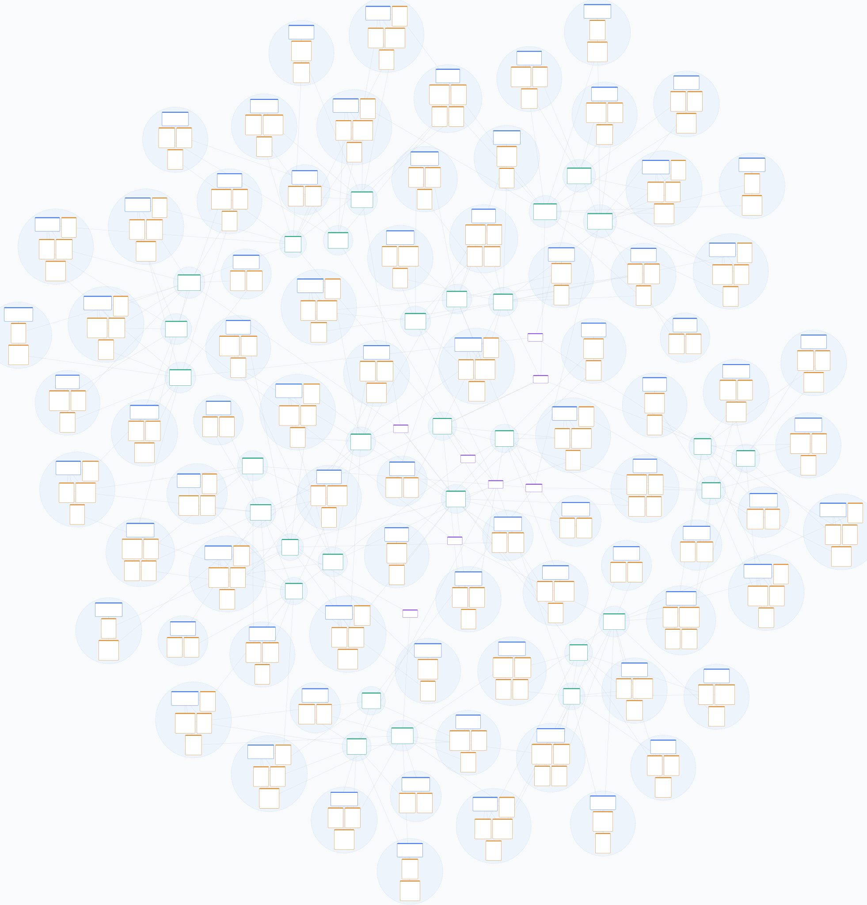

# Sonde — layout de la vue graphe à deux niveaux

**Statut** : sonde terminée, code jetable (`bench/layout-two-level.ts`,
`bench/two-level-compare.ts`)
**Question** : le pipeline actuel (fcose global → `separateOverlaps` →
`separateClusters`) plafonne — 4,2 s à 350 entités, 2,8 % de remplissage, et
trois passes qui se réparent l'une l'autre. Un layout à deux niveaux — packing
intra-agrégat, puis simulation sur les agrégats devenus disques rigides —
fait-il mieux ?

**Réponse courte** : oui, sur tous les axes mesurés, et de loin. ×11 à ×65 plus
rapide, ×2 à ×5,4 plus dense, références inter-agrégats 4,5× plus courtes,
mêmes garanties (zéro recouvrement de cartes ET d'enveloppes, écart
d'enveloppes ≥ 160 px, déterminisme au bit près) — obtenues par construction,
plus par relaxation. La sonde ne règle pas la question du goût (le rendu est
plus régulier qu'« organique ») ni le packing intra-agrégat guidé par les
arêtes, mais elle établit que l'architecture à deux niveaux domine le pipeline
global corrigé.

---

## Le principe

Le pipeline actuel demande à fcose un layout global de toutes les cartes, puis
répare : `separateOverlaps` écarte les cartes (3 000 passes plafonnées),
`separateClusters` écarte les enveloppes (translation rigide). Chaque passe
défait en partie le travail de la précédente, et le coût suit le nombre de
CARTES.

L'appartenance aux agrégats étant une **partition stricte** (aggregate.ts), le
problème se décompose :

1. **Intra-agrégat** — chaque agrégat est packé indépendamment : racine en
   premier, membres triés par id, packing en étagères centrées avec marge de
   16 px incluse. Non-recouvrement par construction. Un agrégat fait 1 à 5
   cartes ici : c'est instantané.
2. **Inter-agrégat** — chaque agrégat devient un **disque rigide** (cercle
   englobant minimal de Welzl + `hullPadding`, exactement la forme que le
   renderer peint). Une entité hors agrégat est un disque singleton. Les
   références inter-agrégats sont agrégées en ressorts pondérés ; une petite
   simulation (ressorts + gravité + collision disque-disque, 400 itérations,
   amorçage FNV-1a) pose les disques, et une passe dure finale garantit
   dist ≥ r₁ + r₂ + `clusterGap` en invariant de sortie.

Conséquences structurelles : plus AUCUNE passe de séparation de cartes (deux
cartes d'agrégats différents ne peuvent pas se toucher puisque leurs disques ne
se touchent pas) ; le coût dominant est O(k² · itérations) sur k agrégats
(100–170 ici), plus le nombre de cartes ; et cytoscape/fcose sortent du chemin
(−178 ko gzip de chunk dynamique si l'approche est retenue).

## Les mesures

`pnpm --filter @defsquare/data-graph-core exec tsx bench/two-level-compare.ts`,
médiane de 3 runs, `clusterGap: 160` et `hullPadding: 18` des deux côtés —
mêmes garanties exigées, donc comparaison à armes égales.

**A. `bigShop(3000)` du cœur** — 334 entités, 167 agrégats de 2 cartes, aucune
arête inter-agrégat (le fixture du calibrage de `clusterGap`) :

| | actuel (fcose + 2 passes) | proto deux niveaux |
|---|---|---|
| temps | 1 624 ms | **143 ms** (×11) |
| bbox | 8 370×8 418 | **6 026×5 929** (aire ÷2,0) |
| remplissage | 6,2 % | **12,3 %** |
| recouvr. cartes / enveloppes | 0 / 0 | 0 / 0 |
| paires de cartes < 16 px | 28 | **0** |
| nn enveloppes moyen | 160,0 px | 160,0 px |
| déterminisme (2 runs) | (asserté par les tests) | **0 px** |

**B. `bigShop(4000)` de la démo** — 350 entités, 108 agrégats + 8 catégories
hors agrégat, 264 références inter-agrégats (le jeu des ~4,2 s de
`setView("graph")`) :

| | actuel (fcose + 2 passes) | proto deux niveaux |
|---|---|---|
| temps | 4 138 ms | **64 ms** (×65) |
| bbox | 18 714×19 984 | **8 083×8 437** (aire ÷5,5) |
| remplissage | 2,8 % | **15,1 %** |
| recouvr. cartes / enveloppes | 0 / 0 | 0 / 0 |
| paires de cartes < 16 px | 20 | 19 — toutes à 16 px − 10⁻¹² (bruit flottant, mesuré : min 15,999999999999) |
| nn enveloppes moyen | 160,2 px | 160,0 px |
| longueur moyenne d'une réf. inter-agrégat | 6 104 px | **1 364 px** (÷4,5) |
| déterminisme (2 runs) | (asserté par les tests) | **0 px** |

Rendus (mêmes données, même échelle logique) :

| | actuel | proto |
|---|---|---|
| A |  |  |
| B |  |  |

Ce que les images montrent et que le remplissage chiffre : dans le pipeline
actuel, fcose éparpille les membres d'un agrégat, donc le cercle englobant
gonfle, donc `separateClusters` écarte de GRANDS cercles presque vides — les
cartes deviennent des confettis dans leurs propres enveloppes. Dans le proto,
le cercle est minimal par construction (les cartes sont packées avant que le
cercle existe), l'enveloppe colle aux cartes, et tout l'écartement est du
couloir utile.

Pourquoi le temps s'effondre : le coût du pipeline actuel est dominé par la
relaxation de 334–350 cartes (jusqu'à 3 000 passes O(n²)) ; celui du proto par
400 itérations O(k²) sur 116–167 disques. Le nombre de cartes ne pèse plus que
dans le packing local, linéaire et négligeable.

## Les réserves — ce que la sonde ne tranche pas

1. **Le packing intra-agrégat ignore les arêtes.** Les membres sont posés par
   id, pas par connectivité : une référence intra-agrégat peut traverser le
   bloc. Invisible à 2–5 cartes par agrégat (les fixtures d'ici), réel sur des
   agrégats de dizaines de cartes — là il faudrait un placement local guidé
   par les arêtes (radial autour de la racine, ou mini-force locale). C'est un
   raffinement DANS une case de l'architecture, pas une remise en cause.
2. **L'esthétique est régulière, pas organique.** Les îlots de A forment un
   pavage quasi hexagonal. C'est assumable (c'est lisible) mais c'est un choix
   de produit ; un bruit déterministe par id peut casser la régularité si
   l'aspect « vivant » compte.
3. **O(k²) sur les agrégats.** 143 ms à 167 clusters ; à ~1 000 agrégats la
   simulation naïve coûterait des secondes. Une grille spatiale pour la
   collision et Barnes-Hut pour les ressorts la ramèneraient à k log k — à ne
   faire que si ce cardinal devient réel.
4. **Les ressorts du niveau 2 sont naïfs** (force fixe 0,15, poids plafonné à
   2, gravité 0,02). Aucun balayage de réglages n'a été fait — les chiffres
   ci-dessus sont ceux du PREMIER jeu de constantes essayé, ce qui suggère que
   l'architecture est robuste au réglage, mais un calibrage à la façon de
   `clusterGap` resterait à faire avant d'en faire le défaut.
5. **La passe dure finale peut défaire un ressort** : la garantie d'écart prime
   sur la longueur d'arête. À 264 références sur 116 disques ça ne se voit pas
   (1 364 px de moyenne, contre 6 104 avant) ; un graphe inter-agrégat très
   dense pourrait se dégrader — non sondé.

## Recommandation

Basculer la vue graphe sur l'architecture à deux niveaux. Elle rend
`separateOverlaps` et `separateClusters` inutiles dans cette vue (ils restent
utilisés/utilisables ailleurs), sort cytoscape+fcose du bundle, et fait passer
`setView("graph")` de ~4,2 s à ~65 ms sur le jeu de la démo — assez rapide pour
relayouter en direct, ce qui rend aussi caduque l'urgence du Web Worker pour
cette vue. Les garanties du tableau « Graph view » du README (zéro
recouvrement, déterminisme, enveloppes écartées) sont toutes REPRODUITES et
plusieurs passent de « mesurées avec plafond » à « par construction ».

Chemin proposé, par étapes commitables :

1. Porter `layout-two-level.ts` dans `src/` derrière l'interface
   `GraphLayoutEngine` existante (elle est déjà respectée par la sonde), tests
   de garanties repris de `layout-graph.test.ts`.
2. Aiguillage dans le renderer + mise à jour des budgets du README (les
   chiffres de cette sonde deviennent les nouveaux points de mesure).
3. Retirer l'ancien moteur et les deux dépendances si plus rien ne les importe.
4. (Plus tard, si besoin) placement intra-agrégat guidé par les arêtes, et
   calibrage des constantes du niveau 2.

## Ce que contient la sonde

- `packages/core/bench/layout-two-level.ts` — le moteur proto (packing en
  étagères + simulation de disques), même signature de sortie que
  `createGraphLayoutEngine().layout()`.
- `packages/core/bench/two-level-compare.ts` — harnais : les deux fixtures, les
  métriques (bbox, remplissage, recouvrements, marges, nn d'enveloppes,
  longueur des références inter-agrégats, déterminisme) et l'export des quatre
  SVG ci-dessus. Il importe `apps/demo/src/sample-data.ts` — dépendance
  cœur→démo assumée parce que jetable.

**Tout est jetable.** Si la recommandation n'est pas suivie, les deux fichiers
de bench et les quatre SVG partent, ce doc reste.
