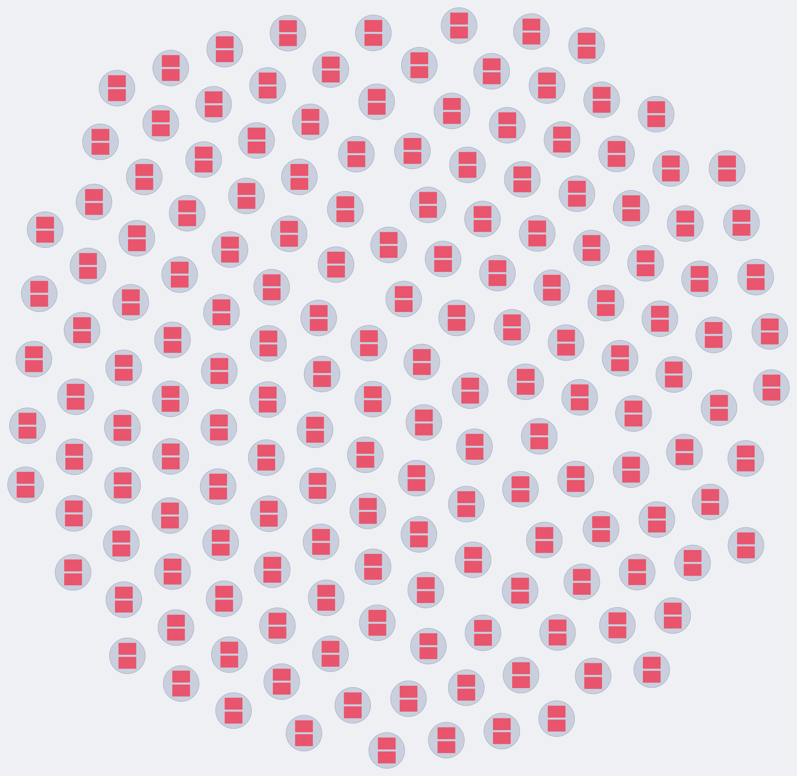
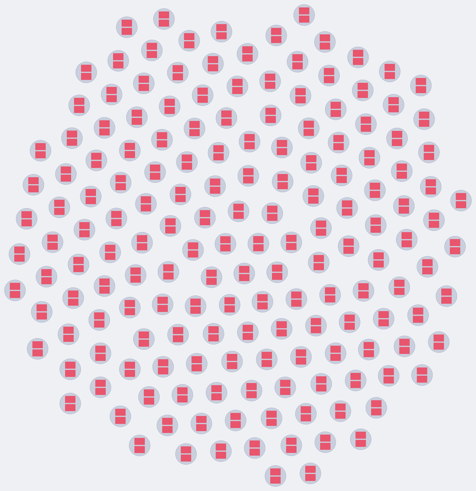
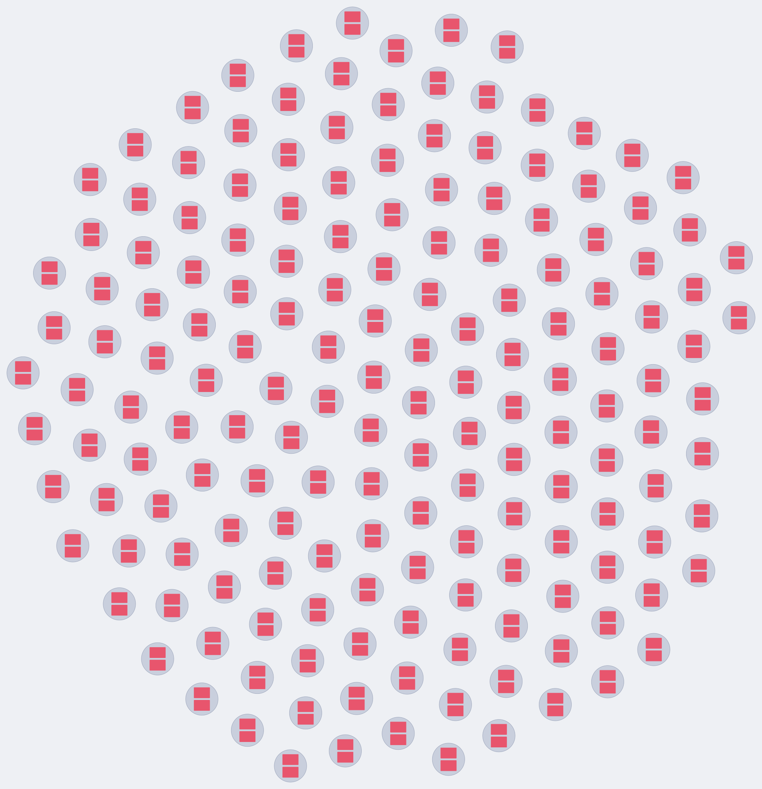
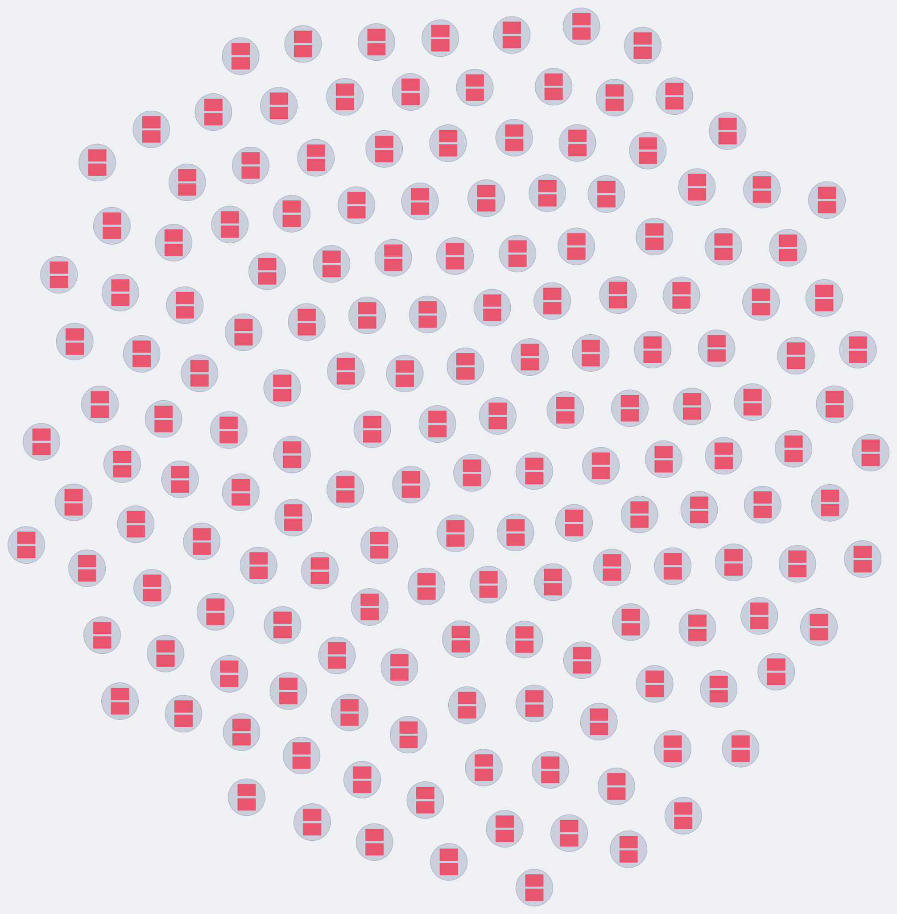

# Sonde — raffinements du moteur de layout à deux niveaux

**Statut** : en cours. Étapes décidées par l'utilisateur, remplies au fil de
l'eau. Toutes faites : A, A-bis, B et C.

| | étape | statut |
|---|---|---|
| A | placement intra-agrégat RADIAL (racine au centre, anneaux par distance) | **faite** |
| A-bis | aiguillage radial / étagères par PROFONDEUR | **faite** |
| B | bruit déterministe contre la régularité du pavage | **faite** |
| C | calibrage mesuré des constantes du niveau 2 | **faite** |

Le moteur porté par ces trois étapes est `packages/core/src/layout-two-level.ts`.
Sa sonde d'origine, et la comparaison qui a retiré le pipeline fcose, sont dans
`2026-09-01-two-level-layout.md`.

---

## Étape A — placement radial intra-agrégat

**Question** : le packing en étagères posait les membres d'un agrégat par ordre
d'ID, sans regarder les références. Sur un agrégat profond, les chaînes de
références zigzaguent et la racine n'est nulle part en particulier. Un placement
radial — racine au centre, un anneau par distance de référence — fait-il mieux,
et à quel prix ?

**Réponse courte** : oui sur ce qu'il vise, franchement, et le prix est réel et
mesuré. Les références intra-agrégat raccourcissent de 39 % en moyenne et de
50 % au pire, et la racine passe du 40e au 1er rang par proximité au centre de
son propre disque. En échange le disque enfle : le remplissage global tombe de
12,3 % à 7,8 % sur le jeu du cœur et de 15,1 % à 10,9 % sur celui de la démo.
**Sur ces deux jeux-là, le radial ne gagne rien et ne fait que coûter** — leurs
agrégats font 1 à 5 cartes et n'ont aucune chaîne à redresser. Le gain n'existe
qu'à partir d'agrégats profonds, qu'aucun jeu réel du dépôt ne contient encore.
C'est ce constat qui a conduit à l'aiguillage de l'étape A-bis : les chiffres de
cette section-ci sont donc ceux du RADIAL PARTOUT, un état intermédiaire que le
moteur livré n'a plus.

### Le fixture, parce qu'il n'y en avait pas

Aucun fixture du dépôt ne produisait un gros agrégat : `bigShop` en fait de 2
cartes, le jeu de la démo monte à 5. Impossible de mesurer quoi que ce soit sur
la connectivité intra-agrégat avec ça.

`deepAggregate()` (dans `packages/core/test/fixtures.ts`) produit **un seul
agrégat de 41 cartes sur quatre niveaux** :

```
Customer  ←  Order  ←  OrderLine  ←  Serial
dist. 0      dist. 1    dist. 2      dist. 3
   1            4          12           24
```

Les arités sont paramétrables (`deepAggregate(5, 3, 3)` → 66 cartes, dont un
anneau de 45 qui force la scission d'anneau).

Un détail qui n'en est pas un : la largeur des cartes vient d'une table de sept
longueurs (`NOTE_LENGTHS`), **première avec les arités de l'arbre** (4, 3, 2,
PPCM 12). Indexer cette table par un compteur dont la période diviserait une
arité donnerait à toutes les cartes d'un anneau la même largeur ; le placement
radial deviendrait un cas parfaitement régulier, et le calcul de circonférence
— qui existe précisément pour gérer des largeurs hétérogènes — ne serait jamais
exercé par un test qui passerait pourtant.

### La baseline — packing en étagères, sur `deepAggregate()`

| | étagères |
|---|---|
| référence intra-agrégat, moyenne | 591,4 px |
| référence intra-agrégat, max | 976,3 px |
| centralité de la racine (centre carte → centre disque) | 597,7 px |
| rang de la racine par proximité au centre | **40 / 41** |
| rayon du disque | 712,3 px |

Le rang 40 sur 41 n'est pas un hasard malheureux, c'est mécanique : le tri par
id posait la racine en tête de la première ligne, donc dans un COIN du bloc,
c'est-à-dire au point le plus éloigné du centre du cercle englobant. La carte
qui donne son nom et son sens à l'agrégat était la plus excentrée de toutes.

### Le résultat

| | étagères | radial |
|---|---|---|
| réf. intra, moyenne | 591,4 px | **363,0 px** (−39 %) |
| réf. intra, max | 976,3 px | **488,1 px** (−50 %) |
| centralité de la racine | 597,7 px | **16,4 px** (−97 %) |
| rang de la racine | 40 / 41 | **1 / 41** |
| rayon du disque | 712,3 px | 1 044,1 px (+47 %) |

### La géométrie, et ce qui porte la garantie

Le non-recouvrement avec marge `cardGap` reste acquis PAR CONSTRUCTION, en deux
conditions indépendantes, toutes deux écrites sur les **disques englobants** des
cartes (demi-diagonale) — une condition suffisante qui rend le problème
indépendant de l'angle.

1. **Dans un anneau** : une carte de disque ρ à la distance R se voit allouer la
   largeur angulaire `α = 2·asin((ρ + gap/2)/R)`. Deux cartes séparées d'au
   moins `α_i/2 + α_j/2` ont une corde `2R·sin(Δθ/2) ≥ ρ_i + ρ_j + gap`, parce
   que `sin x + sin y = 2·sin((x+y)/2)·cos((x−y)/2)` et que le cosinus vaut au
   plus 1. La condition de bouclage est `Σα ≤ 2π` : c'est elle qui traite la
   paire dernière/première.
2. **Entre anneaux** : `R_k = R_{k−1} + ρmax_{k−1} + ρmax_k + gap`, donc deux
   cartes d'anneaux différents sont distantes d'au moins la somme de leurs
   rayons plus la marge (le pire cas est l'alignement radial).

**Scission d'anneau.** Un anneau ne peut pas « échouer » — on pourrait toujours
grossir R —, mais ce R croît linéairement en N. On remplit donc gloutonnement au
rayon minimal autorisé, et le reste part sur un anneau suivant à la même
distance logique. Les sous-anneaux se comportent en tout point comme des anneaux
pour la condition 2, donc la garantie traverse la scission. Le remplissage se
termine toujours : `α ≤ π` pour toute carte, donc au moins une tient par
sous-anneau.

**Ordre dans l'anneau** : par angle du parent, puis par id. Chaque sous-anneau
est ensuite tourné en bloc pour que sa première carte se pose à l'angle de son
parent — une rotation rigide, donc sans effet sur la garantie.

### Le coût, chiffré

Le prix du radial est structurel, pas un défaut de réglage : **un anneau coûte
un diamètre de carte de rayon même s'il ne porte qu'une seule carte**. Le disque
enfle donc avec la PROFONDEUR plus qu'avec le nombre de cartes.

Rayon du disque d'un agrégat isolé, étagères → radial :

| cartes | forme | étagères | radial | ratio |
|---|---|---|---|---|
| 1 | racine seule | 121 px | 121 px | ×1,00 |
| 2 | 1 anneau | 162 px | 209 px | ×1,29 |
| 3 | 1 anneau | 225 px | 335 px | ×1,49 |
| 4 | 1 anneau | 280 px | 335 px | ×1,20 |
| 5 | 1 anneau | 258 px | 371 px | ×1,44 |
| 5 | **2 anneaux** | 296 px | 602 px | **×2,03** |
| 9 | 2 anneaux | 365 px | 597 px | ×1,64 |
| 10 | **3 anneaux** | 350 px | 899 px | **×2,57** |
| 41 | 3 anneaux | 712 px | 1 044 px | ×1,47 |
| 66 | 3 anneaux | 856 px | 1 352 px | ×1,58 |

Noter que le pire cas n'est PAS le petit agrégat, contrairement à l'intuition :
c'est l'agrégat **profond et maigre** (5 cartes sur 3 niveaux, ×2,03 ; 10 cartes
sur 4 niveaux, ×2,57), où chaque anneau paie son diamètre pour une ou deux
cartes.

Effets globaux, sur les deux jeux réels du dépôt :

| | étagères | radial |
|---|---|---|
| **A** `bigShop(3000)` cœur — 334 cartes, 167 agrégats de 2 | | |
| bbox | 6 026 × 5 929 | 7 588 × 7 396 (aire ×1,58) |
| remplissage | 12,3 % | **7,8 %** |
| rayon moyen des disques | 141,7 px | 187,0 px |
| temps (médiane de 3) | 175 ms | 168 ms |
| **B** démo `bigShop(4000)` — 350 cartes, 116 blocs | | |
| bbox | 8 083 × 8 437 | 9 710 × 9 780 (aire ×1,45) |
| remplissage | 15,1 % | **10,9 %** |
| rayon moyen des disques | 262 px | 331 px |
| réf. inter-agrégat moyenne | 1 364 px | 1 657 px (+21 %) |
| temps (médiane de 3) | 74 ms | 72 ms |

Le temps ne bouge pas : le placement reste linéaire en cartes et c'est la
simulation O(k²) du niveau 2 qui domine.

### L'hybride — chiffré ici, décidé en A-bis

Distribution réelle des tailles d'agrégats, mesurée :

- **A** : 167 agrégats, **tous de 2 cartes**.
- **B (démo)** : 30 de 1 carte, 26 de 3, 26 de 4, 26 de 5. **Maximum : 5.**

Un hybride « étagères en dessous d'un seuil, radial au-dessus » :

| seuil | A remplissage | B remplissage |
|---|---|---|
| étagères partout | 12,3 % | 15,1 % |
| **hybride ≤ 2** | **12,3 %** | 10,9 % |
| **hybride ≤ 3** | **12,3 %** | 12,2 % |
| **hybride ≤ 5** | **12,3 %** | **15,1 %** |
| radial partout (retenu) | 7,8 % | 10,9 % |

`hybride ≤ 5` récupère **100 %** de la densité sur les deux jeux, tout en
donnant le radial aux agrégats profonds. C'est tentant, et c'est précisément
pourquoi il n'a pas été retenu : **5 est exactement la taille maximale
d'agrégat des deux fixtures**. Un seuil choisi pour qu'aucun jeu existant ne
prenne le chemin neuf est un seuil ajusté sur les fixtures, pas sur une raison —
il ferait passer les chiffres au vert sans qu'on sache ce qu'il vaudra sur un
jeu réel de forme différente.

---

## Étape A-bis — l'aiguillage, par PROFONDEUR

**Décision de l'utilisateur**, après le chiffrage ci-dessus : hybride, mais sur
la profondeur et non sur le cardinal.

> Radial si et seulement si **au moins un membre est à distance de référence
> ≥ 2 de la racine** (BFS réel, ORPHELINS exclus du critère). Étagères sinon.

**La justification.** Le mécanisme du radial est d'encoder la profondeur de
référence en distance au centre. À profondeur ≤ 1, tous les non-racines sont
équidistants de la racine : il n'y a rien à encoder, la structure lue par l'œil
ne dit rien de plus que « ces cartes appartiennent à cette racine » — ce que
l'enveloppe disait déjà —, et le radial n'apporte que son coût (×1,29 à ×2,03 de
rayon, mesuré plus haut). Le critère **ne mentionne aucune taille**, donc il
n'est pas ajusté aux fixtures : il est ajusté à la raison d'être du radial.

**Pourquoi les orphelins sont exclus.** Un membre que le BFS local n'atteint pas
— maillon intermédiaire masqué — reçoit en radial un anneau SYNTHÉTIQUE au-delà
du dernier. Cet anneau ne traduit aucune profondeur de référence, seulement une
absence d'information. Sans l'exclusion, un agrégat parfaitement plat dont une
carte serait détachée basculerait en radial et en paierait le prix pour rien.

**Le résultat, mesuré sur les trois fixtures :**

| | étagères partout | radial partout | **hybride (livré)** |
|---|---|---|---|
| A `bigShop(3000)`, agrégats plats | 12,3 % | 7,8 % | **12,3 %** |
| B démo, agrégats plats | 15,1 % | 10,9 % | **15,1 %** |
| B, bbox | 8 083 × 8 437 | 9 710 × 9 780 | **8 083 × 8 437** |
| B, réf. inter-agrégat | 1 364 px | 1 657 px | **1 364 px** |
| `bigShopWithReviews`, 3 cartes, prof. 1 | étagères | radial | **étagères** |
| `deepAggregate()`, 41 cartes, prof. 3 | réf. 591,4 px | réf. 363,0 px | **réf. 363,0 px** |
| `deepAggregate()`, rang de la racine | 40/41 | 1/41 | **1/41** |

Densité intégralement récupérée sur les jeux plats, gains radiaux intégralement
conservés sur le jeu profond.

Le couple qui montre que le critère lit bien la profondeur et non le cardinal, à
5 cartes des deux côtés :

| | forme | mode | rayon | rang de la racine |
|---|---|---|---|---|
| `deepAggregate(4, 0, 0)` | 4 commandes, profondeur 1 | étagères | 258 px | 4 / 5 |
| `deepAggregate(2, 1, 0)` | 2 commandes + 2 lignes, profondeur 2 | **radial** | 602 px | **1 / 5** |

Même nombre de cartes, modes différents — et le prix du radial (×2,33 de rayon
ici) est payé exactement là où il achète quelque chose.

**Question ouverte, consignée plutôt que devinée.** L'**étoile plate et LARGE**
— profondeur 1, des dizaines de cartes — reste en étagères, alors que la
centralité de la racine pourrait s'y défendre : avec 40 commandes sous un seul
client, la racine se retrouve dans un coin du bloc, ce qui est le défaut même
que le radial corrige ailleurs. Aucun jeu réel du dépôt ne présente cette forme.
On tranchera si elle apparaît.

L'autre piste, toujours non faite : un critère dérivé de la GÉOMÉTRIE plutôt que
de la structure — calculer les deux placements et garder le meilleur rayon. Ça
ne dépendrait d'aucun seuil et coûterait un packing de plus par agrégat
(linéaire, négligeable). Elle règlerait l'étoile large du même coup, mais elle
choisirait sur la densité seule, sans jamais tenir compte de la lisibilité — le
radial serait alors écarté partout où il coûte, c'est-à-dire partout.

### Micro-variante essayée et écartée

Poser l'anneau 1 à l'angle π/2 (première carte SOUS la racine) plutôt qu'à 0 (à
sa droite) : les cartes étant plus larges que hautes, empiler devrait être plus
dense. Mesuré : A 7,8 → **8,6 %** de remplissage (rayon moyen 187 → 174), mais
B 10,9 → **10,7 %** et référence inter-agrégat 1 657 → 1 729 px. Gain sur un
jeu, perte sur l'autre : pas de raison de payer une constante inexpliquée pour
ça. Écartée.

### Welzl : l'avertissement de `hull.ts` vérifié

`hull.ts` n'est pas mélangé, et son commentaire annonçait sans l'avoir mesuré
que l'ordre fixe « cesserait d'être le bon compromis sur des agrégats de
plusieurs centaines de cartes ». C'est juste, et le radial rapproche l'échéance :
il pose les cartes SUR DES CERCLES, donc une grande part des coins se retrouve
près du bord du cercle englobant — le cas adverse de Welzl non mélangé.

Temps par appel, étagères → radial :

| cartes | coins | étagères | radial |
|---|---|---|---|
| 41 | 164 | 0,0187 ms | 0,0352 ms |
| 66 | 264 | 0,0261 ms | 0,0686 ms |
| 157 | 628 | 0,0673 ms | 0,2834 ms |
| 297 | 1 188 | 0,2158 ms | 1,6732 ms |

Croissance bien superlinéaire (×7,2 en cartes → ×48 en temps). **`hull.ts` n'est
pas modifié** : à l'échelle visée (60 cartes) c'est 0,07 ms, et même à 297
cartes ces 1,7 ms pèsent 21 % d'un layout de 7,8 ms, très loin derrière la
simulation O(k²) du niveau 2 (169 ms à 167 disques). Seul son commentaire est
mis à jour, pour porter les chiffres au lieu d'une estimation.

### Ce que l'étape A ne tranche pas

1. **L'hybride ci-dessus** — tranché depuis, voir A-bis : aiguillage par
   profondeur, pas par cardinal.
2. **Le critère par disques englobants est conservateur.** Il ajoute un surcoût
   constant à la marge — 28,6 px mesurés entre deux cartes de `bigShop`, soit
   `ρ₁ + ρ₂ − (w₁ + w₂)/2`. Un test exact rectangle-rectangle récupérerait ces
   pixels, mais l'estimation donne ~13 % du rayon d'anneau, pas les ~50 % qui
   séparent radial et étagères : ce n'est pas le bon levier.
3. **Les orphelins.** Un membre dont le maillon intermédiaire est masqué n'est
   pas atteint par le BFS local et part sur un anneau supplémentaire. Correct et
   déterministe, mais jamais observé sur un jeu réel — la vue graphe ne masque
   rien aujourd'hui.
4. **Rien n'oriente les anneaux entre agrégats.** Le niveau 2 tourne les disques
   librement ; un agrégat pourrait présenter ses feuilles vers son voisin plutôt
   que sa racine. Non sondé.

---

## Étape B — bruit déterministe contre la régularité du pavage

**Question** : le fixture A sort en pavage quasi hexagonal. C'est lisible mais
ça se lit comme une grille, pas comme un graphe. Peut-on casser cette régularité
sans toucher aux garanties ?

**Réponse courte** : oui, avec un seul mécanisme, et sans que rien d'autre ne
bouge. Un gonflement virtuel du rayon PENDANT la simulation seulement suffit :
l'écart-type de l'écart au plus proche voisin passe de **0,00 à 12,02 px**, le
minimum reste à **160,00 px exactement**, et les formes peintes sont
bit-à-bit identiques à celles d'avant.

### D'où vient le pavage

Ce n'est pas un défaut de réglage, c'est le comportement correct de la
simulation. Gravité + collision sur des disques de **même rayon** convergent
vers l'empilement hexagonal — l'optimum de densité de cercles égaux. Le fixture
A a 167 agrégats de taille identique et **aucune arête entre eux** : la
simulation n'a donc que ces deux forces, et rien pour briser la symétrie.

La signature chiffrée : l'**écart-type de l'écart bord à bord au plus proche
voisin** entre disques vaut **0,00 px**. Tous les voisins exactement à
`clusterGap`. C'est la définition d'un réseau.

### Le mécanisme

Chaque cluster reçoit `jitter_i = (FNV-1a de son id, normalisé 0..1) × jitter`,
et la **simulation seule** travaille avec `r + jitter_i`. Le hachage porte un
suffixe `:jitter` distinct de celui de l'amorçage, sans quoi les deux tirages
seraient corrélés.

Trois propriétés, dans l'ordre d'importance :

1. **Les garanties sont rigoureusement inchangées.** La passe dure finale
   utilise le VRAI rayon et le vrai `clusterGap` ; c'est elle, et elle seule,
   qui porte l'invariant de sortie. Vérifié : `min nn = 160,00 px` à 0, 16, 32,
   48 et 64. Un jitter arbitrairement grand ne produirait pas un recouvrement,
   seulement un layout plus aéré.
2. **La forme peinte n'est jamais gonflée.** Le jitter n'entre ni dans le cercle
   englobant ni dans `ClusterShape`. Testé au bit près : les rayons émis à
   `jitter: 0` et `jitter: 64` sont identiques, seules les positions diffèrent.
3. **C'est la VARIANCE qui casse le pavage**, pas un déplacement. Les voisins se
   posent dans `[clusterGap, clusterGap + jitter_i + jitter_j]` au lieu de tous
   tomber sur `clusterGap` : des disques qui ne demandent plus la même place ne
   peuvent plus former un réseau.

C'est l'**unique** source de bruit du moteur. Aucun angle, aucune position ni
aucune constante n'est perturbée ailleurs, et il n'y a toujours ni
`Math.random` ni `Date.now` — le déterminisme au bit près reste testé.

### Le balayage

`bigShop(3000)`, le fixture qui isole l'effet (agrégats uniformes, zéro arête) :

| jitter | é.-type nn | moyenne nn | **min nn** | remplissage | bbox |
|---|---|---|---|---|---|
| 0 | 0,00 px | 160,0 px | **160,00** | 12,3 % | 6 026 × 5 929 |
| 16 | 6,36 px | 166,1 px | **160,00** | 11,2 % | 6 141 × 6 397 |
| **32** | **12,02 px** | 177,9 px | **160,00** | **10,3 %** | 6 394 × 6 692 |
| 48 | 17,65 px | 189,2 px | **160,00** | 9,8 % | 6 617 × 6 806 |
| 64 | 22,72 px | 201,5 px | **160,00** | 8,9 % | 6 917 × 7 142 |

Jeu de la démo, pour mémoire : 15,1 % à 0, 15,5 % à 16, 13,7 % à 32, 14,8 % à
48, 14,0 % à 64. **Non monotone**, et c'est attendu : ses ressorts
inter-agrégats rebattent la mise en page à chaque amplitude, donc la comparaison
amplitude par amplitude n'y a pas de sens fin. Le choix se fait sur A, qui isole
l'effet.

### Le choix, à l'œil

| jitter | rendu |
|---|---|
| 0 |  |
| 16 |  |
| **32 — retenu** |  |
| 48 |  |

Ce que les images montrent, et que l'écart-type chiffre :

- **0** — réseau hexagonal franc. Les rangées et les diagonales s'alignent d'un
  bord à l'autre de la toile.
- **16** — le réseau est perturbé mais les alignements diagonaux survivent par
  plaques. L'œil lit encore une grille. 6,36 px d'écart-type, soit 4 % de
  `clusterGap` : trop peu pour désaligner quoi que ce soit.
- **32** — plus aucun alignement long ne subsiste, et le champ reste
  uniformément dense : ni trou ni grappe. C'est le point où le rendu cesse de se
  lire comme une grille sans se lire comme du désordre.
- **48** — la variance se voit comme telle, certains couloirs faisant
  visiblement le double des autres. Ce n'est pas plus « vivant » qu'à 32, et ça
  coûte 0,5 point de remplissage de plus.

**32 retenu.** Coût : **2,0 points de remplissage** sur A (12,3 → 10,3 %) et une
bbox de 6 026 × 5 929 à 6 394 × 6 692. C'est le prix de la variance : l'écart
MOYEN monte de 160,0 à 177,9 px, puisque gonfler les disques pendant la
simulation les fait converger un peu plus au large.

C'est un réglage d'œil, exposé comme `clusterGap` l'est — `jitter: 0` le
désactive entièrement.

### Ce que l'étape B ne tranche pas

1. **L'amplitude est constante pour tous les clusters.** Un jitter
   proportionnel au rayon (`r × k` au lieu de `+ k px`) donnerait la même
   variance relative aux gros et aux petits agrégats ; sur des jeux à tailles
   très hétérogènes, le jitter absolu perturbe proportionnellement plus les
   petits. Non sondé — les jeux du dépôt ont des agrégats de taille homogène.
2. **Le pavage n'est cassé que là où il existait.** Sur un jeu à ressorts
   denses, la topologie brise déjà la symétrie et le jitter n'a presque rien à
   faire ; il continue pourtant de coûter sa variance. Un jitter modulé par le
   degré inter-agrégat serait plus économe, et bien plus compliqué à justifier.
3. **Aucune mesure perceptuelle.** « Le pavage ne se lit plus comme une grille »
   est un jugement d'œil sur quatre rendus, pas un critère. L'écart-type
   objective la variance, pas la lisibilité.

---

## Étape C — calibrage des quatre constantes du niveau 2

**Question** : force de ressort 0,15, plafond de poids `min(1, w/2)`, gravité
0,02, `simIterations` 400. C'était le premier jeu essayé, jamais balayé, et
c'était documenté comme tel à quatre endroits. Que dit la mesure ?

**Réponse courte** : elle CONFIRME les quatre. C'est l'une des trois issues
prévues, et ce n'est pas une non-décision : « calibré » veut dire mesuré, pas
nécessairement changé. Le balayage a en revanche produit deux résultats qui
n'étaient pas cherchés — la réserve n°5 de la sonde d'origine est observable et
son mécanisme identifié, et les constantes du niveau 2 interagissent avec le
`jitter` de l'étape B.

### Le fixture manquant

Aucun jeu du dépôt n'avait un graphe inter-cluster dense : `bigShop(3000)` en a
**zéro** arête, la démo un degré moyen de 4,6. La réserve n°5 (« un graphe
inter-agrégat très dense pourrait se dégrader — non sondé ») était donc
insondable faute de matériel.

`denseRefs()` (dans `fixtures.ts`) : 40 clients, 40 produits, 3 commandes de 4
produits. Chaque commande appartient à l'agrégat de son client par arbitrage,
donc ses quatre références produit sont toutes inter-cluster. Résultat :
**200 cartes, 80 clusters, 480 arêtes inter-cluster, degré moyen 12,0, max 12**.

Le graphe est **régulier** — 12 partout — et c'est délibéré : la charge de
ressort est la même sur toutes les arêtes, donc on mesure l'effet d'une
constante et non celui d'une hétérogénéité de degré. L'adversité « hub » est
atteignable par paramètre et mesurée séparément : `denseRefs(40, 8)` donne
48 clusters, degré moyen 13,3 et **max 40**.

Les garanties sur ce fixture (recouvrement 0, `clusterGap`, déterminisme,
variante hub) sont assertées dans `layout-two-level.test.ts` **indépendamment du
calibrage** — elles sont portées par le packing et la passe dure, donc elles
doivent tenir à tout réglage.

### Le balayage

Trois fixtures, choisis pour épuiser les régimes : **A** `bigShop(3000)`
(167 disques, zéro arête — seules gravité et collision agissent), **B** le jeu
de la démo (116 disques, degré 4,6), **D** `denseRefs()` (80 disques, degré
12,0). Métrique de qualité : longueur moyenne d'une référence INTER-agrégat.
Un run par configuration — le moteur est déterministe.

**Force de ressort** (réf. inter moyenne) :

| | B | D | sd nn sur D |
|---|---|---|---|
| 0,05 | 2 084 | 1 699 | 13,1 |
| 0,10 | 1 557 | 1 618 | 13,1 |
| **0,15 — retenue** | 1 439 | **1 554** | 11,8 |
| 0,25 | 1 418 | 1 611 | 7,9 |
| 0,40 | 1 398 | 1 694 | 4,1 |

**Plafond de poids `min(1, w/N)`** :

| | B | D | sd nn sur D |
|---|---|---|---|
| N=1 | 1 341 | 1 570 | 4,7 |
| **N=2 — retenu** | 1 439 | **1 554** | 11,8 |
| N=4 | 1 753 | 1 589 | 11,7 |
| N=8 | 2 155 | 1 756 | 12,1 |

**Gravité** :

| | A remplissage | B | D |
|---|---|---|---|
| 0,005 | 8,9 % | 1 445 | 1 543 |
| 0,01 | 9,5 % | 1 407 | 1 614 |
| **0,02 — retenue** | **10,3 %** | 1 439 | 1 554 |
| 0,04 | 10,3 % | 1 497 | 1 572 |
| 0,08 | 10,7 % | 1 687 | 1 685 |

**Itérations** :

| | A rempl. | B | D | sd nn sur D | ms (A/B/D) |
|---|---|---|---|---|---|
| 100 | 9,5 % | 1 609 | 1 742 | 4,1 | 66/45/39 |
| 200 | 10,1 % | 1 487 | 1 647 | 4,4 | 53/36/23 |
| **400 — retenues** | 10,3 % | 1 439 | **1 554** | 11,8 | 88/58/32 |
| 800 | 10,7 % | 1 392 | 1 582 | 12,8 | 170/98/59 |
| 1600 | 9,9 % | 1 392 | 1 560 | 13,0 | 342/187/117 |

A est insensible à la force de ressort et au plafond de poids — il n'a aucune
arête. C'est le contrôle du balayage : les lignes y sont rigoureusement
identiques, ce qui confirme que ces deux constantes n'agissent que par les
ressorts.

### La réserve n°5, observée — et son vrai mécanisme

« La passe dure finale peut défaire un ressort ; un graphe inter-agrégat très
dense pourrait se dégrader. » C'est vrai, et D le montre : au-delà de 0,15, la
longueur moyenne des références **RALLONGE** — 1 554 px à 0,15, 1 611 à 0,25,
1 694 à 0,40. Plus les ressorts tirent, plus la passe dure doit les contredire,
et le résultat net empire.

Mais la mesure corrige la formulation de la réserve : **ce n'est pas la densité
qui dégrade, c'est la force**. À 0,15, D se comporte très bien (1 554 px, son
minimum). La densité rend le phénomène *visible* ; elle ne le cause pas. C'est
aussi pourquoi 0,15 est retenue : c'est le point où les ressorts tirent le plus
fort sans que la contrainte doive les défaire.

### L'interaction non cherchée : constantes × jitter

Les colonnes `sd nn` racontent une seconde histoire. Une force de ressort forte
(0,25 → 7,9 ; 0,40 → 4,1) ou des poids non gradués (N=1 → 4,7) **recompriment le
pavage** et défont le bruit de l'étape B : l'écart-type de l'écart au plus proche
voisin retombe de 11,8 à 4,1 px, soit l'essentiel de ce que `jitter: 32` avait
acheté. Un `simIterations` trop bas fait pareil pour une autre raison — à 100 ou
200 la simulation n'a pas convergé assez pour que la variance s'exprime (4,1 et
4,4).

Les valeurs retenues sont donc aussi celles qui **laissent le jitter
fonctionner**, ce qui n'était pas un critère au moment de le régler. Corollaire
pratique : les constantes retenues étant celles du balayage de l'étape B, `sd nn`
ne bouge pas d'un centième, et **l'amplitude 32 reste valide sans re-rendu**.

### L'arbitrage décliné, exposé

La grille croisée donne un gagnant sur B : `ressort 0,15 / gravité 0,01 / N=1`,
référence moyenne **1 282 px contre 1 439**, soit −11 %. Il est écarté parce
qu'il coûte, sur les deux autres fixtures, l'écart-type de D (11,8 → 6,3, donc le
pavage) et 0,8 point de remplissage sur A (10,3 → 9,5 %).

C'est un **jugement, pas une conclusion de la mesure** : B est un cas nominal
parmi trois, et sacrifier le pavage de A et la densité de D pour 11 % sur lui
seul est un mauvais échange — mais quelqu'un pourrait en juger autrement, et
c'est pour ça que ce paragraphe existe.

### Ce que l'étape C ne tranche pas

1. **Aucun mécanisme nouveau n'a été essayé**, délibérément. Le balayage suggère
   deux pistes qu'il ne faut pas confondre avec des réglages : une **gravité par
   composante connexe** (sur A, la gravité est la seule force compactante et
   agit globalement ; par composante, elle serrerait les îlots sans écraser
   l'ensemble) et une **décroissance non linéaire d'`alpha`** (la moitié des
   itérations sert des déplacements devenus minuscules). Notées, non
   implémentées.
2. **Le balayage est mono-objectif.** La longueur moyenne des références est la
   métrique que les ressorts servent, mais rien ne mesure les CROISEMENTS
   d'arêtes, qui pèsent au moins autant sur la lisibilité.
3. **Trois fixtures ne sont pas une distribution.** A, B et D couvrent degré 0,
   4,6 et 12,0 ; rien ne couvre un graphe inter-agrégat *déséquilibré* (quelques
   composantes très denses et beaucoup d'isolées), qui est la forme la plus
   probable sur des données réelles.
4. **Le harnais de balayage n'est pas commité.** Il exigeait d'exposer les quatre
   constantes en variables mutables du module — utile trente minutes, nuisible
   ensuite. Les tableaux ci-dessus et ceux des `DEFAULTS` sont la trace ; le
   refaire coûte le même patch temporaire.
